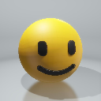

# glTF 1.0 Sample Models

| Model                                         | Screenshot                                       | Description|
|-----------------------------------------------|--------------------------------------------------|------------|
| [Box](Box)                                    |                | One mesh and one material. Start with this. |
| [Box Without Indices](BoxWithoutIndices)      |  | Box without indices for testing the `drawArrays` path. |
| [Box Textured](BoxTextured)                   |        | Box with one texture. Start with this to test textures. |
| [Box Semantics](BoxSemantics)                 |       | Includes extra uniforms to test all uniform semantics. |
| [Duck](Duck)                                  |               | The COLLADA duck. One texture. |
| [Avocado](Avocado)                            |            | An avocado with multiple textures. |
| [Barramundi Fish](BarramundiFish)             |     | A barramundi fish with multiple textures. |
| [Smiling Face](SmilingFace)                   |        | A smiling face with multiple textures. |
| [2 Cylinder Engine](2CylinderEngine)          |    | Small CAD data set, including hierarchy. |
| [Reciprocating Saw](ReciprocatingSaw)         |   | Small CAD data set, including hierarchy. |
| [Gearbox Assy](GearboxAssy)                   |        | Medium-sized CAD data set, including hierarchy. |
| [Buggy](Buggy)                                |              | Medium-sized CAD data set, including hierarchy |
| [Box Animated](BoxAnimated)                   |        | Rotation and Translation Animations. Start with this to test animations. |
| [Cesium Milk Truck](CesiumMilkTruck)          |    | Textured. Multiple nodes/meshes. Animations. |
| [Rigged Simple](RiggedSimple)                 |       | Animations. Skins. Start with this to test skinning. |
| [Rigged Figure](RiggedFigure)                 |       | Animations. Skins. |
| [Walking Lady](WalkingLady)                   |        | Animations. Skins. |
| [Cesium Man](CesiumMan)                       |          | Textured. Animations. Skins. |
| [Monster](Monster)                            |            | Textured. Animations. Skins. |
| [BrainStem](BrainStem)                        |          | Animations. Skins. |
| [Virtual City](VC)                            |                 | Textured. Animations. Skins. |
