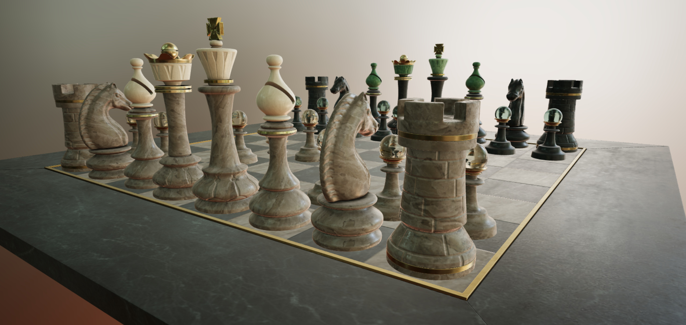
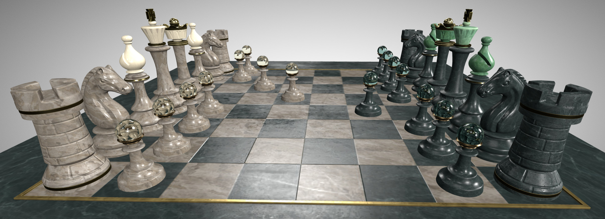

# A Beautiful Game

## Screenshots

_Real-time rendered using [Babylon Sandbox](https://sandbox.babylonjs.com/) with Poly Haven's
[Aerodynamics Workshop HDRI](https://polyhaven.com/a/aerodynamics_workshop),
ACES tone-mapping, and Exposure +2EV._

_Real-time rendered using ThreeJS [glTF Viewer](https://gltf-viewer.donmccurdy.com/) with the
default view settings and neutral lighting._

## Description

The original model was crafted for
[a SideFX tutorial for Karma](https://www.sidefx.com/tutorials/karma-a-beautiful-game/)
by Moeen Sayed and Mujtaba Sayed. It was publicly re-released by the
[Academy Software Foundation](https://www.aswf.io/) during the SIGGRAPH 2022
[ASWF Open Source Days](https://events.linuxfoundation.org/open-source-days/)
set of presentations, which also included one presentation by Bernard Kwok and Pablo Delgado
covering recent developments in MaterialX / glTF interoperability
([video](https://www.youtube.com/watch?v=TQVwu7UMIgg&list=PL9dZxafYCWmzkET3PX23ahXn67usV0tDH&index=3&t=2181))
([slides](https://www.materialx.org/assets/ASWF_OSD2022_MaterialX_OSL_Final.pdf)).
The model geometry was first converted to GLB form by Chris Rydalch and Jonathan Stone in order to be
[contributed to the MaterialX project](https://github.com/AcademySoftwareFoundation/MaterialX/pull/982)
as a sample.

The updated glTF conversion presented here by Ed Mackey provides full glTF PBR materials, including the
transmission and volumetric effects applied to the tops of the Pawns using a pre-release of the
Blender glTF I/O project. A small amount of subsurface scattering on the King and Queen have
been skipped for this iteration as the relevant glTF extensions are still in draft form.
Ambient Occlusion maps were recalculated and merged into glTF's typical
occlusion-roughness-metallic map combinations.

The geometry is separated into individual meshes (instanced where possible), meaning this
version of the model could be used to create a fully interactive chess game with individually
movable pieces.

## Purpose

This sample model demonstrates the power of integration between the USD / MaterialX authoring
workflow and glTF's ability to deliver a GPU-ready final asset for interactive rendering.
This sample is the result of a bespoke conversion intended to show the art of the possible,
exploring changes needed to the asset as it moves from an artist's editing workflow in
USD / MaterialX to the final delivery form in glTF. Ideally this work can serve as
inspiration for more automated conversion tooling in the future.

## License Information

CC-BY 4.0 https://creativecommons.org/licenses/by/4.0/
Academy Software Foundation, MaterialX Project
([ref](https://twitter.com/SheriffStone/status/1560286061854482434))  
with additional conversion by Ed Mackey, AGI.
