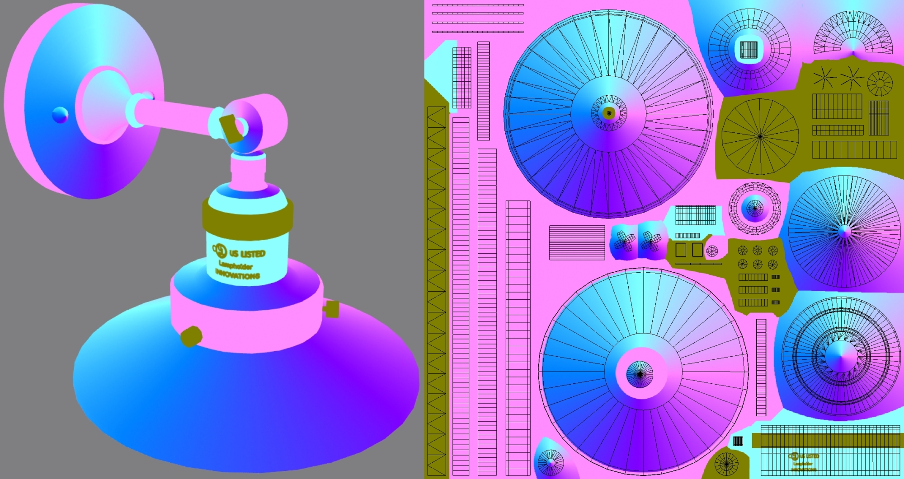

# Anisotropy Barn Lamp


## Screenshot


(above) Screenshot from [Babylon.js Sandbox](https://sandbox.babylonjs.com/).


## Description

This model represents a real Wayfair product, an [Antique Copper Barn Light](https://www.wayfair.com/lighting/pdp/beachcrest-home-clintonpark-1-light-dimmable-barn-light-bkwt7725.html?piid=33004628) with a brushed copper finish. This product was chosen as a stress-test for anisotropic reflections because it has multiple pieces with different brushed-metal directions.

The use of real-world photographic reference is meant to help glTF developers with calibrating material features and renderer behavior, to more accurately represent e-commerce products. Additional photo reference is available [on the Wayfair website](https://www.wayfair.com/lighting/pdp/beachcrest-home-clintonpark-1-light-dimmable-barn-light-bkwt7725.html?piid=33004628).


(above) Photos of the real product.


## Materials

The asset has three meshes, each using its own material. 

The incandescent filament inside the light bulb uses a PBR material with an emissive color and [KHR_materials_emissive_strength](https://github.com/KhronosGroup/gltf/tree/main/extensions/2.0/Khronos/KHR_materials_emissive_strength#khr_materials_emissive_strength) to create high-dynamic range emission. If the renderer supports it, the filament should glow with a bloom effect.

The light bulb glass uses [KHR_materials_transmission](https://github.com/KhronosGroup/glTF/tree/master/extensions/2.0/Khronos/KHR_materials_transmission) and [KHR_materials_volume](https://github.com/KhronosGroup/glTF/tree/master/extensions/2.0/Khronos/KHR_materials_volume) for clear glass with reflection and refraction. 

The metal parts have multi-layer surface reflections. The copper is covered with fine grooves which cause anisotropic-stretched reflections, here replicated with [KHR_materials_anisotropy](https://github.com/KhronosGroup/glTF/pull/1798). Some of the copper has oxidized in the corners reducing reflectivity and metalness. The grooves and oxidation are present in the baseColorTexture and in the roughnessTexture, which is in the green channel of the `metallicRoughnessTexture`. The metal parts have additionally been covered in a glossy clearcoat glaze which contributes non-anisotropic reflections, here simulated with [KHR_materials_clearcoat](https://github.com/KhronosGroup/glTF/tree/master/extensions/2.0/Khronos/KHR_materials_clearcoat). 


Anisotropy enabled (above left), compared with disabled (above right).

The anisotropy rotation is varied across the model using an `anisotropyTexture`. The red channel and green channel control the rotation relative to the surface tangents, while the blue channel acts as a scalar or mask for the overall anisotropy. Radial gradient sweeps are used to create the radial anisotropy where the metal parts have been brushed in a circular pattern. 


(above) A closeup of the `anisotropyTexture` for the metal material. From left: RGB combined, red channel, green channel, and blue channel.


(above) A diagram to show which colors to use in the `anisotropyTexture` to get specific results on different parts of the model.
* Ellipses show the colors which will stretch reflections in various directions.
* Arrows indicate directions of microgrooves or hairs (perpendicular to anisotropy).
* Circle at bottom right is the color to use for zero anisotropy (black in the blue channel). Gray has been used in the red and green channels for this area, but this is not strictly necessary since zero blue completely disables anisotropy. 

There is a close correlation between the texture coordinates and the `anisotropyRotation`, because surface tangents are calculated from the UVs and the surface normals of the model. This is explained in a video from Babylon.js [Unraveling Advanced Anisotropic Reflections](https://www.youtube.com/watch?v=Zk0A5UzNLNw).



(above) Texture coordinates for the metal material, displayed with the `anisotropyTexture`. 

The parts with vertical UV strips are assigned a pink color to stretch the anisotropy in a horizontal direction (perpendicular to the brushed pattern) while the horizontal UV strips use a cyan color to stretch the anisotropy in a vertical direction. 

When a bump texture is in use with anisotropy, high frequency bump details may need to have anisotropy disabled to achieve better bump lighting results. In this asset, the raised text and knurled grips have been assigned a greenish-yellow color to disable anisotropy.


(above) The affect of each color channel in the `anisotropyTexture`. Left to right: the full anisotropy texture, filling the red channel with black, filling the green channel with black, filling the blue channel with black. 

Both the red and green channels are needed for well-shaped anisotropic reflections. The blue channel can be used to disable anisotropy where micro-grooves are not prominent on the surface.


## KTX2 BasisU Textures

A variant of the asset is provided KTX2 textures using [Basis Universal texture compression](https://github.com/KhronosGroup/KTX-Software). The PNG textures were processed with UASTC compression using `toktx`, then referenced in the glTF using the [KHR_texture_basisu](https://github.com/KhronosGroup/glTF/blob/master/extensions/2.0/Khronos/KHR_texture_basisu/) extension. 

The KTX2 textures end up with smaller file sizes (about half) and crucially with much smaller GPU memory footprint (about one fifth) than the PNG textures. With careful attention to compression settings, there is virtually no visual difference between the PNG and KTX2 textures, when the models are rendered side-by-side. For information on compression settings, see the [KTX Artist Guide](https://github.com/KhronosGroup/3D-Formats-Guidelines/blob/main/KTXArtistGuide.md#ktx-artist-guide). 

```
toktx --t2 --encode uastc --uastc_quality 4 --uastc_rdo_l .25 --uastc_rdo_d 65536 --zcmp 22 --assign_oetf linear --assign_primaries none AnisotropyBarnLamp_anisotropy.ktx2 AnisotropyBarnLamp_anisotropy.png --verbose

toktx --t2 --encode uastc --uastc_quality 4 --uastc_rdo_l .25 --uastc_rdo_d 65536 --zcmp 22 --assign_oetf srgb --assign_primaries srgb AnisotropyBarnLamp_basecolor.ktx2 AnisotropyBarnLamp_basecolor.png --verbose

toktx --t2 --encode uastc --uastc_quality 4 --uastc_rdo_l .25 --uastc_rdo_d 65536 --zcmp 22 --assign_oetf linear --assign_primaries none AnisotropyBarnLamp_normalbump.ktx2 AnisotropyBarnLamp_normalbump.png --verbose

toktx --t2 --encode uastc --uastc_quality 4 --uastc_rdo_l .25 --uastc_rdo_d 65536 --zcmp 22 --assign_oetf linear --assign_primaries none AnisotropyBarnLamp_occlusionroughnessmetal.ktx2 AnisotropyBarnLamp_occlusionroughnessmetal.png --verbose
```


## Creation Details

The asset was created using [3ds Max](https://www.autodesk.com/products/3ds-max), exported to glTF using [Max2Babylon](https://github.com/BabylonJS/Exporters#babylonjs-exporters), and materials were edited in [Visual Studio Code](https://code.visualstudio.com/) with [glTF Tools](https://github.com/AnalyticalGraphicsInc/gltf-vscode#gltf-tools-extension-for-visual-studio-code).


## License Information

Copyright 2023 Wayfair LLC, model and textures by Eric Chadwick, CC BY 4.0 International https://creativecommons.org/licenses/by/4.0/