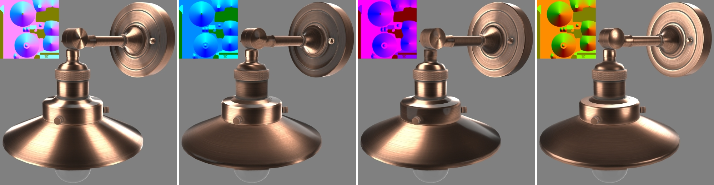

# Anisotropy Barn Lamp

## Screenshot

(above) [Babylon.js Sandbox](https://sandbox.babylonjs.com/) screenshot.

## Description

This model represents a real Wayfair product, an [Antique Copper Barn Light](https://www.wayfair.com/lighting/pdp/beachcrest-home-clintonpark-1-light-dimmable-barn-light-bkwt7725.html?piid=33004628) with a brushed copper finish. This product was chosen as a stress-test for anisotropic reflections because it has multiple pieces with different brushed-metal directions.

The use of real-world photographic reference is meant to help glTF developers with calibrating material features and renderer behavior, to more accurately represent e-commerce products. Additional photo reference is available [on the Wayfair website](https://www.wayfair.com/lighting/pdp/beachcrest-home-clintonpark-1-light-dimmable-barn-light-bkwt7725.html?piid=33004628).

(above) Photos of the real product.

## Materials

The asset has three meshes, each using its own material. 

The incandescent filament inside the light bulb uses a simple material with an emissive color.

The light bulb glass uses [KHR_materials_transmission](https://github.com/KhronosGroup/glTF/tree/master/extensions/2.0/Khronos/KHR_materials_transmission) and [KHR_materials_volume](https://github.com/KhronosGroup/glTF/tree/master/extensions/2.0/Khronos/KHR_materials_volume) for clear glass with reflection and refraction. 

The metal parts use [KHR_materials_anisotropy](https://github.com/KhronosGroup/glTF/pull/1798) to reproduce the stretched anisotropic reflections from the brushed-metal surfaces, and [KHR_materials_clearcoat](https://github.com/KhronosGroup/glTF/tree/master/extensions/2.0/Khronos/KHR_materials_clearcoat) for the clear finish on top of the metal. 

Anisotropy enabled (above left), compared with disabled (above right).

The anisotropy direction is controlled with the `anisotropyDirectionTexture`. The red channel and green channel control the direction relative to the surface tangents, while the blue channel acts as a scalar or mask for the overall anisotropy. Radial gradient sweeps are used to create the radial anisotropy where the metal parts have been brushed in a circular pattern. 

(above) A closeup of the `anisotropyDirectionTexture` for the metal material.

(above) A diagram to show which colors to use in the `anisotropyDirectionTexture` to get specific results on different parts of the model.
* Ellipses show the colors which will stretch reflections in different directions.
* Arrows indicate directions of microgrooves or hairs (perpendicular to anisotropy).
* Circle at bottom right is the color to use for zero anisotropy (black in the blue channel).

There is a close correlation between UV texture coordinates and the `anisotropyDirection`. Surface tangents are calculated from the UVs and the surface normals of the model. This is further explained in a video from Babylon js [Unraveling Advanced Anisotropic Reflections](https://www.youtube.com/watch?v=Zk0A5UzNLNw) on Youtube.

(above) Texture coordinates for the metal material. The parts with vertical UV strips are assigned a pink color to stretch the anisotropy in a horizontal direction (perpendicular to the brushed pattern) while the horizontal UV strips use a cyan color to stretch the anisotropy in a vertical direction.

(above) The affect of each color channel in the `anisotropyDirectionTexture`. Left to right: the full anisotropy texture, filling the red channel with black, filling the green channel with black, filling the blue channel with black. 

Both the red and green channels are needed for well-shaped anisotropic reflections. The blue channel can be used to emphasize the brushed-metal effect by decreasing anisotropy in the grooves.

## Creation Details

The asset was created by Eric Chadwick, Staff Technical Artist at Wayfair, using [3ds Max](https://www.autodesk.com/products/3ds-max), exported to glTF using [Max2Babylon](https://github.com/BabylonJS/Exporters#babylonjs-exporters), and materials were edited in [Visual Studio Code](https://code.visualstudio.com/) with [glTF Tools](https://github.com/AnalyticalGraphicsInc/gltf-vscode#gltf-tools-extension-for-visual-studio-code).

Special thanks to Patrick Ryan and Gary Hsu for their assistance with Babylon.js, and to everyone in the Khronos 3D Formats working group for their work on the anisotropy extension.

## License Information

Copyright 2022 Wayfair LLC. CC BY 4.0 International https://creativecommons.org/licenses/by/4.0/
