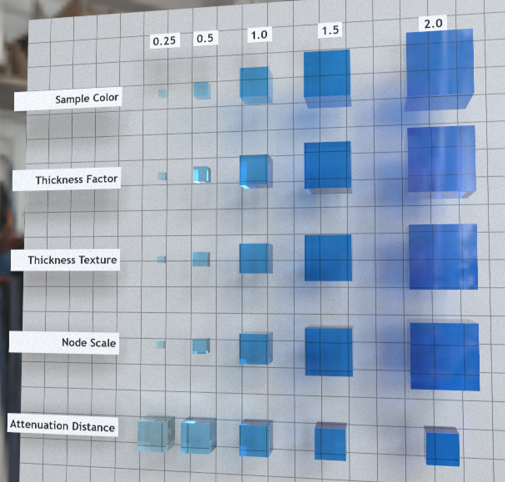

# Attenuation Test

## Screenshot

Path-traced render by the [Enterprise PBR Sample Renderer](https://github.com/DassaultSystemes-Technology/dspbr-pt), using IBL "Artist Workshop" by [HDRI Haven](https://hdrihaven.com/hdri/?h=artist_workshop).  Turn off "autoscale scene" before loading in this particular renderer.

## Description

This model tests interactions between attenuation color, attenuation distance, and thickness in the `KHR_materials_volume` extension.  The material on display here is intended to represent a tinted blue glass, where thinner or smaller chunks of the material are lighter blue, and larger or thicker chunks are deeper blue.  The test should be viewed face-on, not at an angle, as the assigned thicknesses match the lengths of the cube edges, not the cubes' inner diagonals.

Generally, an implementation can pass the test offered by this model if it displays a uniform shade of blue in each vertical column.  If any row is a different shade from neighbor rows, it likely indicates a problem.

### Sample Color

The top row "Sample Color" does not use attenuation at all.  It emulates the "correct" colors by varying the base color on the surface of each sample, according to the [attenuation formulas](https://github.com/KhronosGroup/glTF/tree/master/extensions/2.0/Khronos/KHR_materials_volume#attenuation) given in the `KHR_materials_volume` specification.  This row serves as an answer key for all of the other rows.

### Thickness Factor

The next row "Thickness Factor" is the first test of the tinted blue solid material.  The attenuation color and attenuation distance are constant across the row, but the cube meshes vary in size, and the `thicknessFactor` for each cube matches the length of one edge of the corresponding cube.  A non-raytracing rasterizer can use the `thicknessFactor` to gauge the depth of the material, and adjust the material color according to the attenuation formulas mentioned above.  A path-tracer or ray-tracer will merely test if `thicknessFactor` is zero (because zero means thin-walled, non-zero means volumetric), but the numeric thickness value will be ignored, and instead the world-space thickness of the geometry will be calculated by path tracing.  If the camera is viewing mostly straight through the cubes, this should result in mostly the same thickness being discovered by path tracer calculations and by rasterizers reading the thickness value.

### Thickness Texture

The "Thickness Texture" row is largely the same as the one above it, except the entire row is a single mesh, with a single material.  This row's material has a `thicknessFactor` of `2.0`, which is the thickness of the largest cube, and the cubes use a `thicknessTexture` to indicate which parts of this row's mesh belong to smaller cubes.  As is typical for glTF, the final thickness value is the product of the factor (uniform) and the texture (sampled).

### Node Scale

The "Node Scale" row tests the interaction between thickness and scale.  Each cube on this row uses the same unit-size cube mesh, with the same material, attenuation, and thickness.  Only the glTF node's scale is varied across the row.  The `thicknessFactor` is given in the mesh's raw vertex space, but the `attenuationDistance` is a material property in world space.  In a path tracer, larger nodes with larger cubes naturally produce deeper colors from attenuation.  But a rasterizer must take the node's scale into account, adapting the `thicknessFactor` into world space before use with the material.

### Attenuation Distance

In the final row, "Attenuation Distance", the cubes are a different size from all of the other rows.  This row features all unit-size cubes, and the attenuation distance of each cube has been adjusted to be the inverse of the cube's thickness on the other rows.  This means that although the size of these cubes may appear different, the shade of blue coloring of each cube should match the coloring of the rest of the column.

## License Information

Copyright 2021 Analytical Graphics, Inc.  
CC-BY 4.0 https://creativecommons.org/licenses/by/4.0/  
Model and textures by Ed Mackey.
