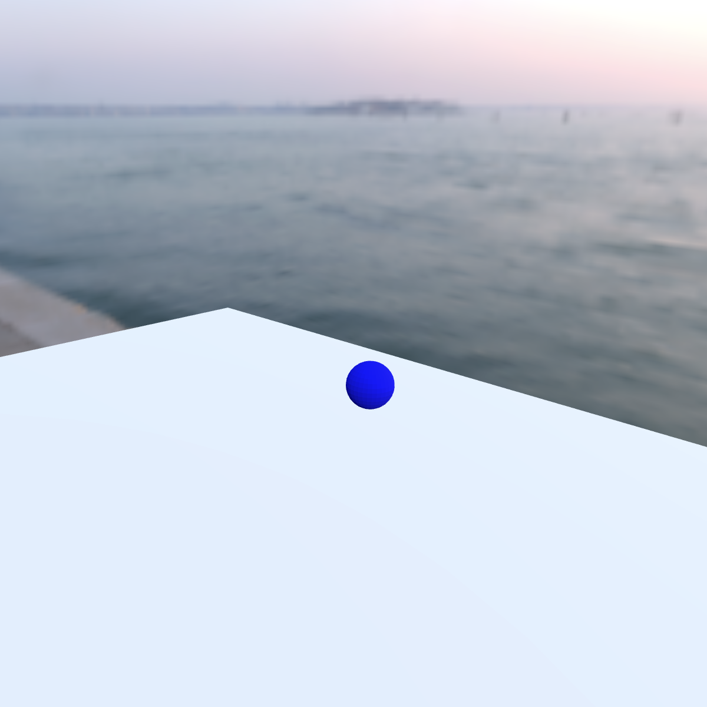

# Audio Simple

Simple asset to test the KHR_audio extension. This model contains one global audio emitter and one positional audio emitter. The positional audio emitter is attached to the node with the blue sphere mesh. This sphere is animated around the origin of the scene.

In a correct implementation of KHR_audio, you should hear the talking audio coming from the blue sphere circling around the origin. You should also hear some ambient audio including tropical birds chirping at a constant 50% gain no matter where your audio listener is in the scene.

## Screenshot

## License Information

The model was created by Robert Long (Matrix.org Foundation)

All audio comes from freesound.org
- https://freesound.org/people/ZyryTSounds/sounds/222993/
- https://freesound.org/people/yottasounds/sounds/232134/

All assets are licensed CC0

  
