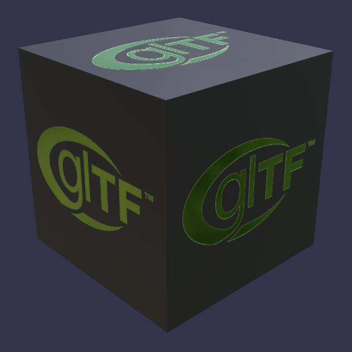

# Box With Spaces

## Screenshot

## Description

The binary file is called `Box With Spaces.bin`, testing runtime support for the presence of spaces in a URI.  Three textures
also have spaces in their URIs, but each space character is URI-encoded as `%20`.

Client implementations are expected to URI-decode all URIs present in a glTF model, even when they represent files on a
local disk.  See [#1449](https://github.com/KhronosGroup/glTF/issues/1449) for additional comments.

## License Information

glTF™ is a trademark of the Khronos Group Inc.  Follow the [Khronos Logo Usage Guidelines](https://www.khronos.org/legal/trademarks/)
when reproducing the glTF™ logo.

The cube model is   
To the extent possible under law, Analytical Graphics has waived all copyright and related or neighboring rights to this asset.
