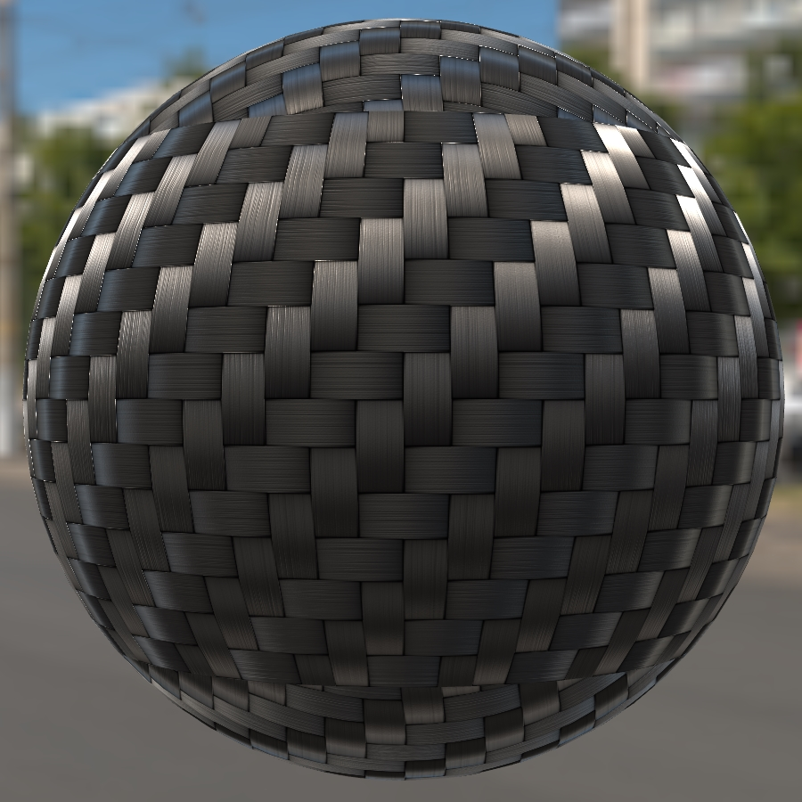
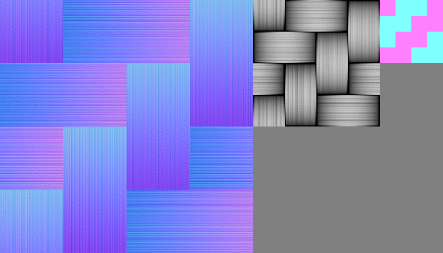

# Carbon Fibre

## Screenshot

Screenshot from the [glTF Sample Viewer](https://github.khronos.org/glTF-Sample-Viewer-Release/) with the Wide Street environment light.

## Description

This model is a sphere using the glTF extension [`KHR_materials_anisotropy`](https://github.com/KhronosGroup/glTF/tree/master/extensions/2.0/Khronos/KHR_materials_anisotropy) to create a carbon fibre material. 

The normalTexture is a higher resolution than the others to preserve more details in the shapes of individual fibres. The anisotropyTexture could in theory be only 4x4 pixels however that tends to introduce upscale artifacts. 

## License Information

(C) 2023, Wayfair LLC. CC-BY 4.0 International https://creativecommons.org/licenses/by/4.0/. Model and textures created by Eric Chadwick.
