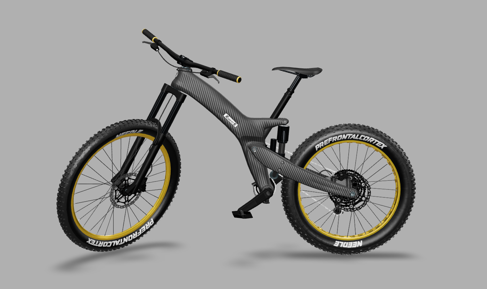
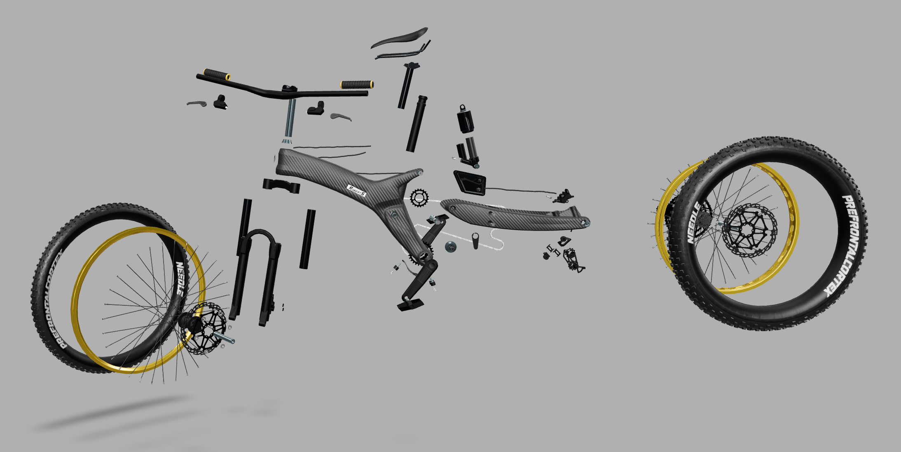
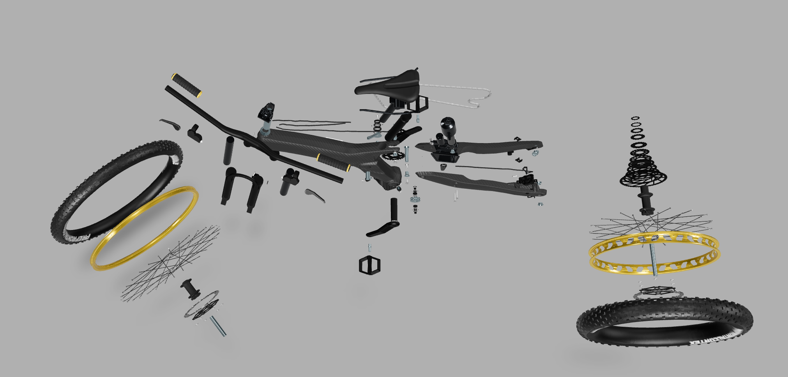
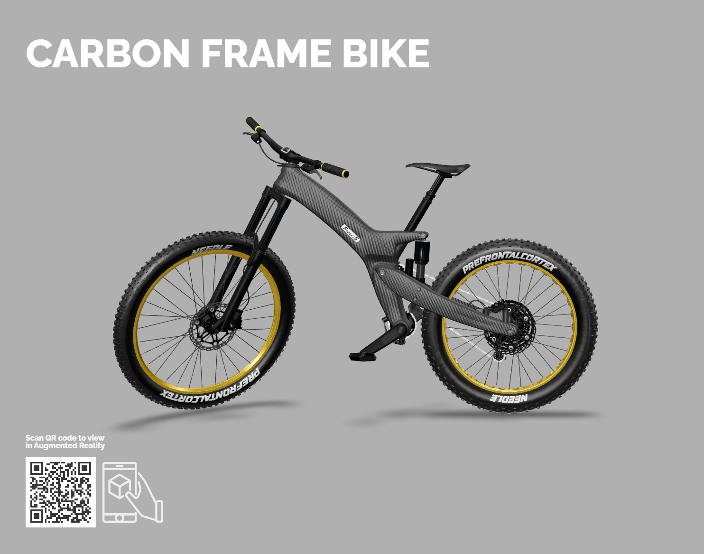

# Carbon Frame Bike

## Video

https://user-images.githubusercontent.com/2693840/178115484-82ace076-0a34-4635-8ec7-e9dd89e26dbd.mp4

_Explosion View Loop_

## Screenshot

  
_Side View_  

  
_Explosion View_  

  
_Top View_  

## Description

This is an animated production model of a mountain bike.  
It contains lots of animated parts and skinned meshes for the wires.  

A matching USDZ file is available on the USD Working Group's usd-wg/assets repository:  
https://github.com/prefrontalcortex/usd-wg-assets/tree/carbon-frame-bike/full_assets/CarbonFrameBike

_Link will be updated once the PR to include the asset has been merged_

## Interactive / Augmented Reality

[Link to Interactive Web Player](https://prefrontalcortex.de/labs/model-viewer/upload/CarbonFrameBike/) – Browser uses glTF, iOS AR uses USDZ  

## License Information

Bike Model by [Robert Schweier](http://www.roberts-bikes.de/).  
Realtime version and animation by Felix Herbst / [prefrontal cortex](https://prefrontalcortex.de) with additional support from [Needle](https://needle.tools).  

>   
"Carbon Frame Bike" by [Robert Schweier](http://www.roberts-bikes.de/) and [prefrontal cortex](https://prefrontalcortex.de) is licensed under a [Creative Commons Attribution-ShareAlike 4.0 International License](http://creativecommons.org/licenses/by-sa/4.0/).  