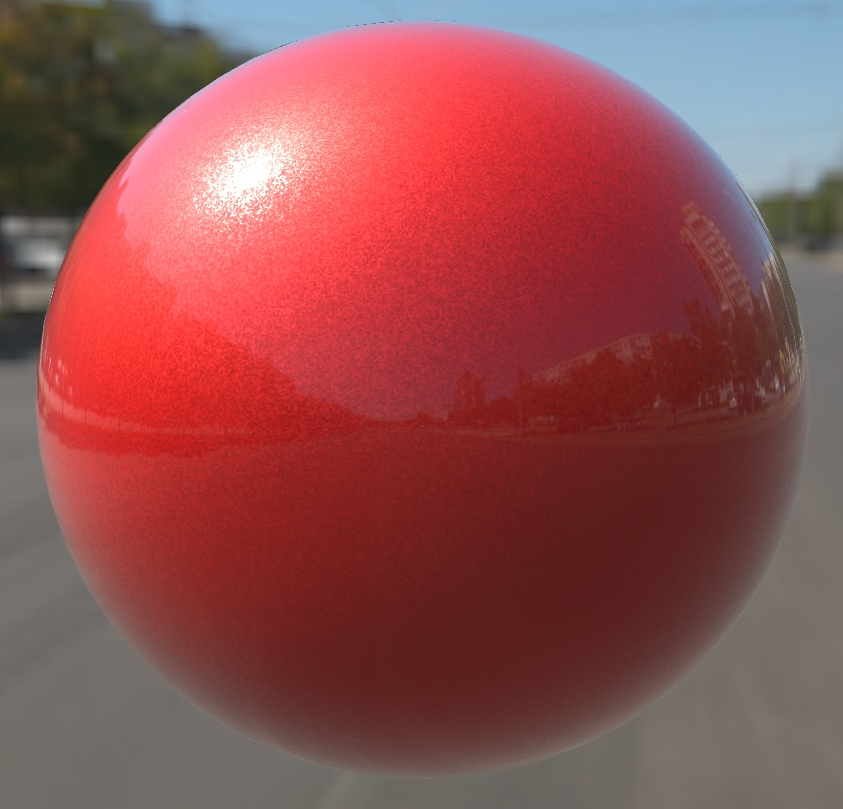

# Clear Coat Car Paint

## Screenshot

Screenshot from the [glTF Sample Viewer](https://github.khronos.org/glTF-Sample-Viewer-Release/) with the Wide Street environment light.

## Description

This model is a sphere using the glTF extension [`KHR_materials_clearcoat`](https://github.com/KhronosGroup/glTF/tree/master/extensions/2.0/Khronos/KHR_materials_clearcoat) overtop a car paint base material. 

The base material is meant to mimic the scattering from micro flakes such as used in some car paints. 

The model uses a single bitmap for the normal bump texture with a random per-pixel noise pattern, and the glTF extension [`KHR_texture_transform`](https://github.com/KhronosGroup/glTF/tree/main/extensions/2.0/Khronos/KHR_texture_transform) to increase bump tiling. 

The normal bump texture, enlarged 200% to show detail.

Roughness was increased to 0.4 to scatter the reflected light and to provide a contrast with the clear coat layer which uses zero Roughness. Metalness was set arbitrarily to a partial value of 0.3 to increase the specularity of the base material.

## License Information

CC0, No Rights Reserved, https://creativecommons.org/share-your-work/public-domain/cc0/. Model and texture created by Eric Chadwick.
