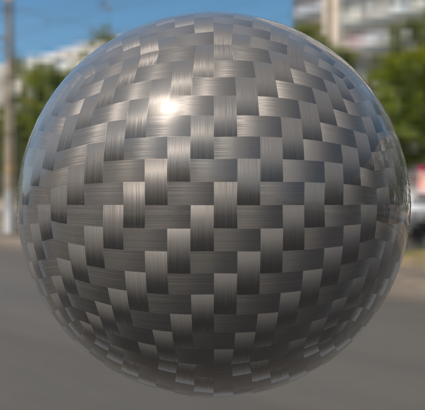

# Clear Coat Carbon Fibre

## Screenshot

Screenshot from the [glTF Sample Viewer](https://github.khronos.org/glTF-Sample-Viewer-Release/) with the Wide Street environment light.

## Description

This model is a sphere using the glTF extension [`KHR_materials_clearcoat`](https://github.com/KhronosGroup/glTF/tree/master/extensions/2.0/Khronos/KHR_materials_clearcoat) overtop a carbon fibre base material, using a single bitmap for the normal bump texture. 

The normal bump texture uses the glTF extension [`KHR_texture_transform`](https://github.com/KhronosGroup/glTF/tree/main/extensions/2.0/Khronos/KHR_texture_transform) to increase bump tiling.

## License Information

CC0, No Rights Reserved, https://creativecommons.org/share-your-work/public-domain/cc0/. Model and texture created by Eric Chadwick.
