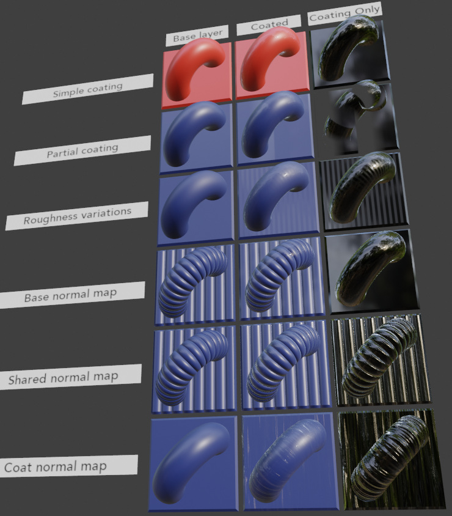
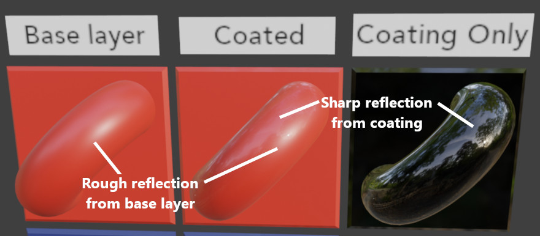
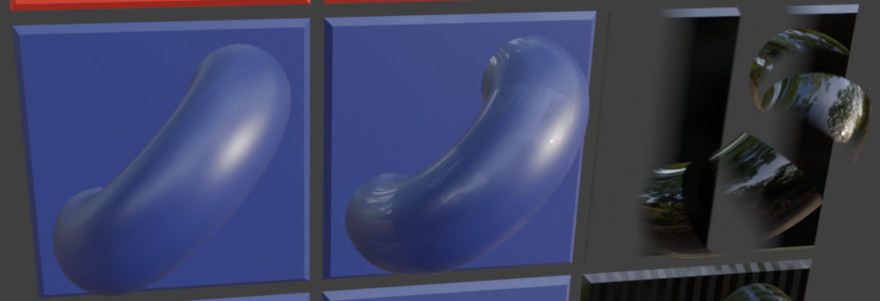

# KHR_materials_clearcoat Test

## Screenshot

## Description

This model tests various settings and textures from the [`KHR_materials_clearcoat`](https://github.com/KhronosGroup/glTF/tree/master/extensions/2.0/Khronos/KHR_materials_clearcoat) glTF extension.

### Columns

There are three columns:

- **Base Layer** - A base material with no coating.

- **Coated** - The combination of the outer two columns, using [`KHR_materials_clearcoat`](https://github.com/KhronosGroup/glTF/tree/master/extensions/2.0/Khronos/KHR_materials_clearcoat).

- **Coating Only** - This is a base material with settings copied from just the coating in the central column.

The right-most column may visually appear as flat-black objects with various clear coatings applied.  Indeed, such black objects do not need to make use of the `KHR_materials_clearcoat` extension, as the coating itself can be represented as a core glTF 2.0 material when the
underlying layer reflects no light.

The central "Coated" column uses `KHR_materials_clearcoat` to combine the material settings from the outer two columns.

To read this test, examine how highlights reflect on the left and right columns ("Base layer" and "Coating only"), and then check the middle "Coated" column to see if it shows evidence of reflected highlights from both of the other columns.  It will not be a pixel-perfect match, but it should be visually apparent that the major highlights from the other two columns have been combined.

It is recommended to have an environment with distinctive bright light sources for testing.

If the center column appears to have exactly the same reflections as the left column, it likely means the glTF viewer you're using does not yet support the `KHR_materials_clearcoat` extension.  Check if a newer version of the viewer is available, or check if an issue exists to implement support for it.

### Simple coating

This row simply turns on the `KHR_materials_clearcoat` extension in the middle column, with some reasonable non-textured settings.

### Partial coating

This row uses a texturemap to turn clear coat on and off for different sections of the geometry.  It is emulated in the right column with an alpha blend, making the coating disappear where it has been turned off.  In the middle column with the `KHR_materials_clearcoat` extension, this value is read from the `R` (Red) channel, as linear (not sRGB) values.

The center column should show bands where the coating has been applied and un-applied.  The right column may look a little strange due to the use of alpha-blending, but its bands align with the center column's bands.

### Roughness variations

This row offers a striped pattern with different roughness values for the coating.  Roughness is read from the `G` (Green) channel, as linear (not sRGB) values.

### Base normal map

The base layer on this row has a pattern of bumps, but the coating is smooth.  The center column should appear as if the bumps are visible under smooth glass.  As before, look for reflected highlights in both of the outer columns, and then look for those same highlights in the center column.

### Shared normal map

On this row, the same normal map has been applied to both the base layer and the coating.  This makes the coating appear very thin, as if it follows the curves of the base layer closely.  Even so, the base layer has more roughness, so its reflections will be visibly different from the coating's reflections.  Both sets of reflections should combine in the center column.

### Coat normal map

This row uses a normal map on the coating, while the base layer is smooth.  In this case it is intended to look similar to clear plastic wrap (but without any roughness variation).  In the center column, the base layer's wide reflections should be visible under the coating's thin reflections.

## License Information

Copyright 2020 Analytical Graphics, Inc.
CC-BY 4.0 https://creativecommons.org/licenses/by/4.0/
Model and textures by Ed Mackey.
