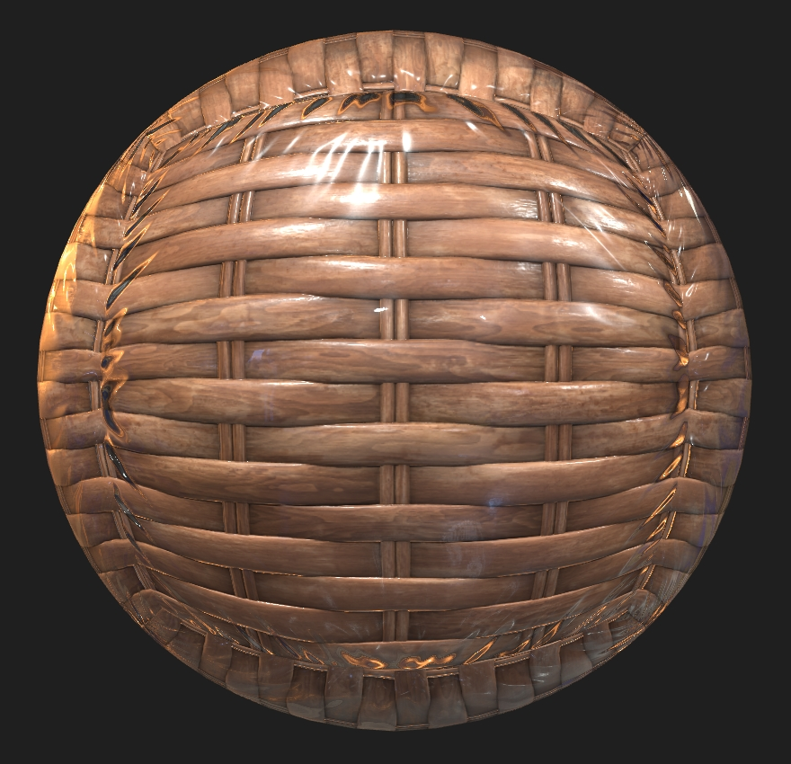

# ClearcoatWicker

## Screenshot

Screenshot from the [glTF Sample Viewer](https://github.khronos.org/glTF-Sample-Viewer-Release/) with the Colorful Studio environment light.

## Description

This model is a sphere using the glTF extension [`KHR_materials_clearcoat`](https://github.com/KhronosGroup/glTF/tree/master/extensions/2.0/Khronos/KHR_materials_clearcoat) to create a wicker material covered with a wrinkled plastic clearcoat, to demonstrate the usage of a clearcoat bump texture. 

## License Information

CC0, No Rights Reserved, https://creativecommons.org/share-your-work/public-domain/cc0/. Model and textures created by Eric Chadwick.
