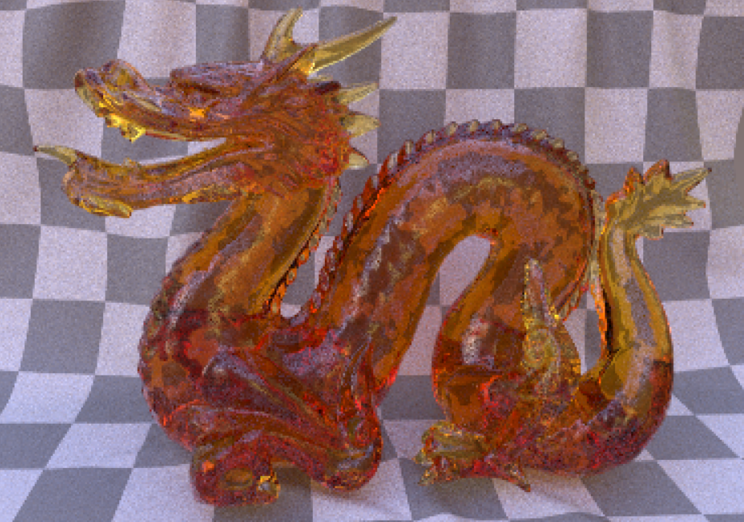
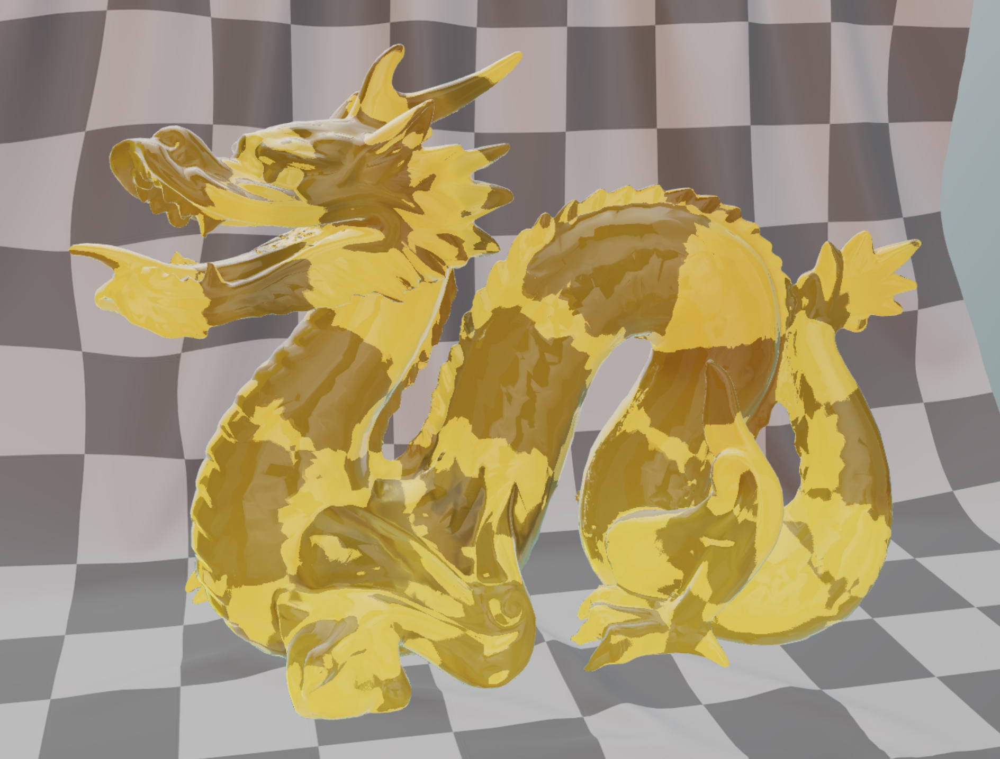
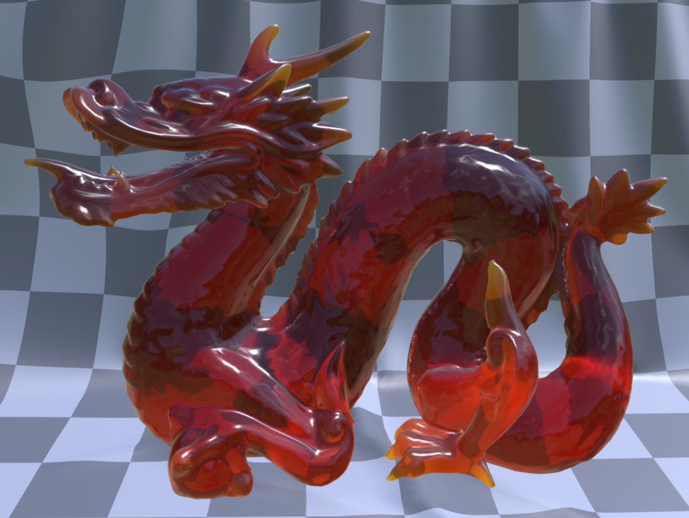

# Dragon Attenuation

## Screenshot

Rasterized (without ray tracing or path tracing) by the [Khronos glTF Sample Viewer](https://github.khronos.org/glTF-Sample-Viewer-Release/), using IBL "Footprint Court" by [HDR Labs](http://www.hdrlabs.com/sibl/archive.html).

## Description

This model demonstrates the use of the `KHR_materials_transmission` and `KHR_materials_volume` extensions to specify an object that appears to be made from colored glass.

The "Attenuation" material on the dragon uses full transmission with a perfectly smooth, clear surface color.  The yellow and orange tones are produced by `KHR_material_volume`'s `attenuationColor` and `attenuationDistance`.

### Thick Volume vs. Thin-Walled

By default, glTF 2.0 and `KHR_materials_transmission` specify "thin-walled" materials, where the mesh's polygons are immeasurably thin.  Any ray of light hitting such a polygon would enter and immediately exit the material.  There is no refraction present on such a material, except for some possible blurriness introduced by rough microfacets on its surface.

However, `KHR_materials_volume` introduces the new parameters `thicknessFactor` and `thicknessTexture`.  When `thicknessFactor` is non-zero, the material definition changes from thin-walled to a thick volume.  The mesh's polygons are then considered to represent a manifold surface surrounding a solid three-dimensional volume of material.  This material produces refraction, as shown in the screenshot above where the view through the dragon distorts the checkerboard grid of the cloth behind it.

For rasterizers that do not use ray tracing or path tracing, the product of `thicknessFactor` and `thicknessTexture` offer an average mesh thickness per texel along the surface.  This allows for example the dragon's thin claws to absorb less light and appear lighter yellow, while the dragon's thicker body appears a deeper orange.

Because the `KHR_materials_ior` extension is not present, glTF's default IOR of 1.5 is used for the material.

## Path Traced

Path-traced render by the [Enterprise PBR Sample Renderer](https://github.com/DassaultSystemes-Technology/dspbr-pt), using IBL "Footprint Court" by [HDR Labs](http://www.hdrlabs.com/sibl/archive.html).

Ray tracers and path tracers must still test `thicknessFactor > 0.0` to determine if the material is in thin-walled mode or thick.  Beyond that, they are free to disregard the thickness approximation, and trace the true thickness per ray.

## Material Variant: Surface Color

This model features a second material variant (via `KHR_materials_variants`), called "Surface Color."  This variant specifies the same yellow color, but specifies it as a `baseColor` on the surface of a thick volume, with no attenuation inside the volume.  This means the yellow color will be constant across the surface of the dragon, and not darken with thickness.  The `thicknessFactor` and `thicknessTexture` are still supplied, so this variant offers the same refraction of the background grid as the other material.

## Common Problems

If the dragon appears a deep red color, it may indicate that node scaling has not been properly accounted for.  The `thicknessFactor` is specified in raw mesh vertex space, so must be adjusted for glTF nodes that have scaling applied.  The `attenuationDistance` is a material property, specified in world space.

See the "Node Scale" row of the [Attenuation Test Model](https://github.com/KhronosGroup/glTF-Sample-Models/tree/master/2.0/AttenuationTest) for an example of this effect using uniform thickness values.

## License Information

The two meshes in this model (the dragon, and the cloth backdrop) are from different sources and have different licenses applied.

### Dragon

The dragon model based on the one from [Morgan McGuire's Computer Graphics Archive](https://casual-effects.com/data).  
Original dragon mesh data based on a [Stanford Scan](http://www.graphics.stanford.edu/data/3Dscanrep/)
&copy; 1996 Stanford University.

### Cloth Backdrop

  
To the extent possible under law, Adobe has waived all copyright and related or neighboring rights to this asset [the cloth backdrop].
