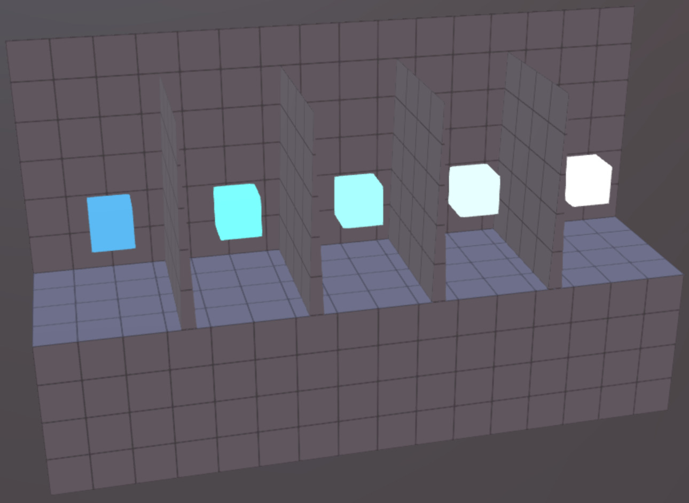
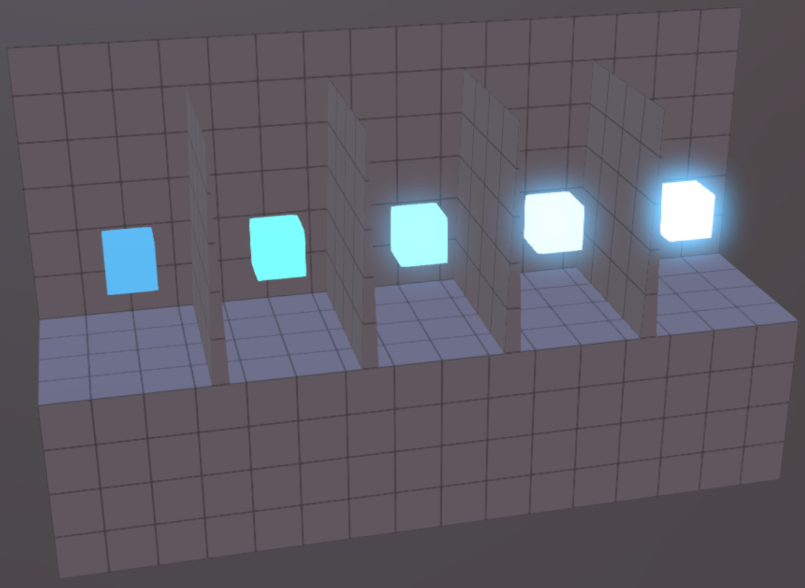
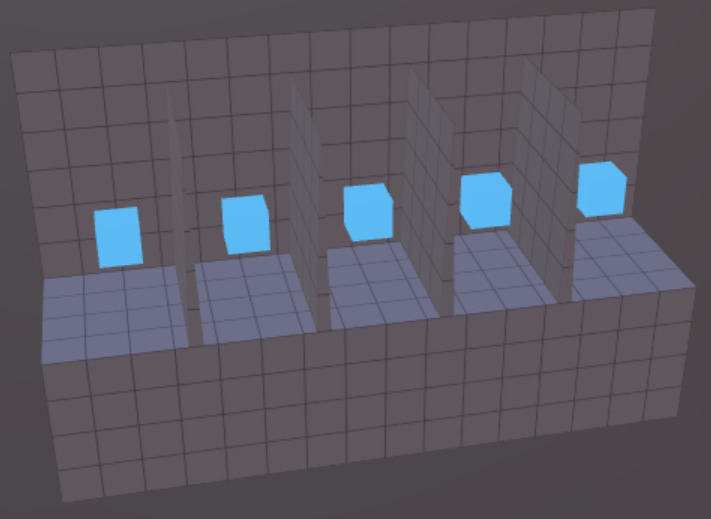

# Emissive Strength Test

## Screenshots

### Plain Rendering (Test Passes)

### Render with Optional Bloom Effect Enabled

These screenshots were rendered in BabylonJS with the default IBL strength dialed
down to help the glow stand out.  The second screenshot has an optional "Bloom" effect
applied using the BabylonJS Default Rendering Pipeline.

## Description

This model tests if the `KHR_materials_emissive_strength` extension is available in a
given implementation.  If it is not, the cubes will all emit the same shade of
light blue.  For implementations that support this extension, the cubes will be
progressively brighter to the right.

## Cube Colors

The basic emissive color of all the cubes is `[0.1, 0.5, 0.9]` in the glTF file, which
is expected to undergo the usual linear-to-sRGB transfer before being shown to the viewer.
The cube on the far left has no emissive strength extension (`1x`), and each subsequent
cube doubles the strength (`2x`, `4x`, `8x`, and `16x`).

With a simple output mapping, the cube on the far right may appear as
plain white, due to all of its color components being clamped to the 1.0 upper limit.
If "bloom" effects are enabled, some cubes may appear to glow.  In a path-tracing
engine, all of these cubes may emit light, but the ones on the right should
emit substantially more light.

## Test Failure

If a given implementation does not support `KHR_materials_emissive_strength`, the
boxes will all appear to emit the same color.  For example:

## License Information

Copyright 2022 Analytical Graphics, Inc.
CC-BY 4.0 https://creativecommons.org/licenses/by/4.0/
Model and textures by Ed Mackey.
