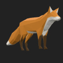

# Fox

## Screenshot

## Description

This model demonstrates animated rigging with three different animation cycles: Survey, Walk, and Run.  These animations all drive the same joints, so for this model, only one animation should be active at any given time.  glTF [specifies](https://github.com/KhronosGroup/glTF/tree/master/specification/2.0#animations) that the client implementation may choose when to play any of the available animations.

## License Information

[CC0](https://creativecommons.org/publicdomain/zero/1.0/): Low poly fox [by PixelMannen](https://opengameart.org/content/fox-and-shiba)

[CC-BY 4.0](https://creativecommons.org/licenses/by/4.0/): Rigging and animation [by @tomkranis on Sketchfab](https://sketchfab.com/models/371dea88d7e04a76af5763f2a36866bc)

glTF conversion [by @AsoboStudio and @scurest](https://github.com/KhronosGroup/glTF-Sample-Models/pull/150#issuecomment-406300118)
