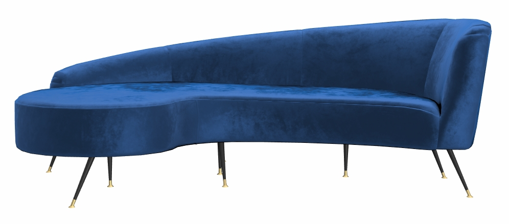
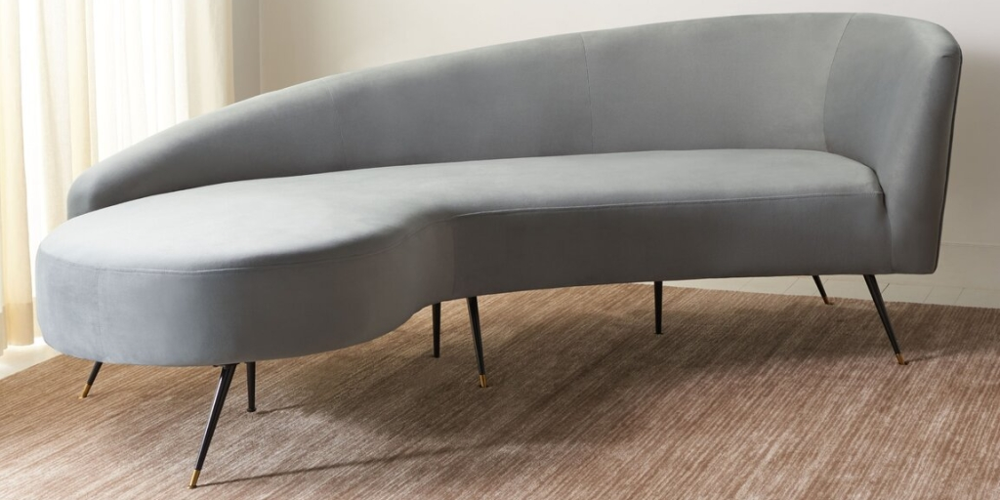
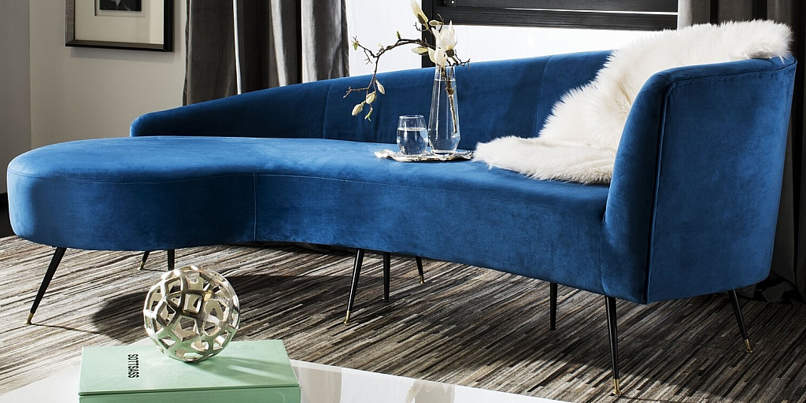
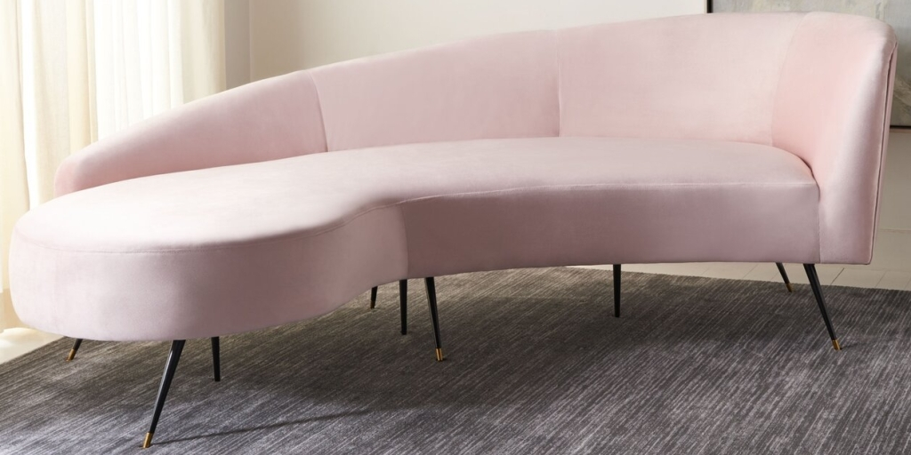
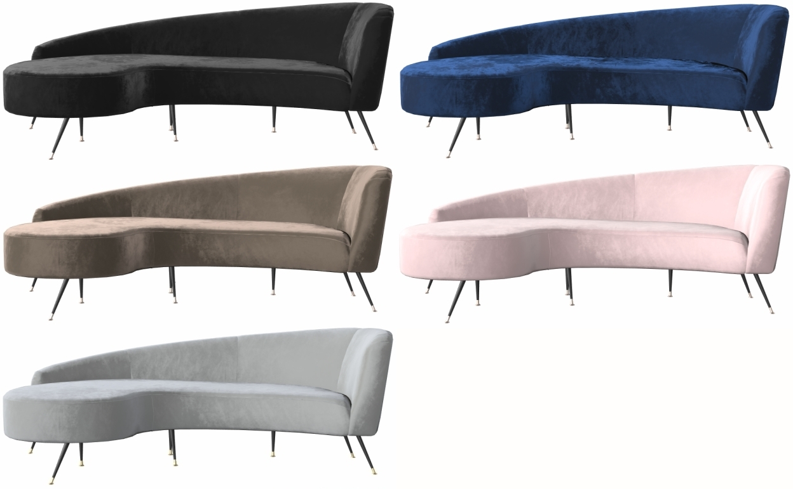
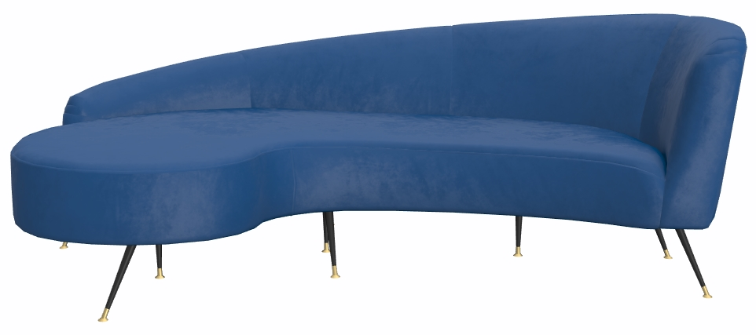
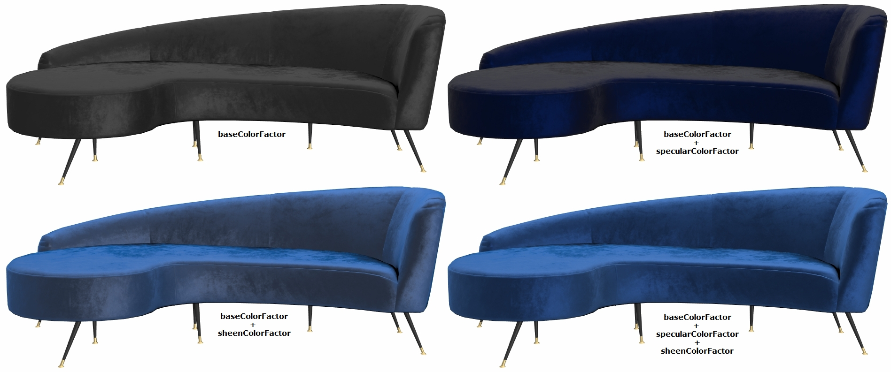

# GlamVelvetSofa

## Screenshot

Above: screenshot from the [Babylon.js Sandbox](https://sandbox.babylonjs.com/).

## Description

This model represents a real product, a velvet sofa bed being sold [on the Wayfair website](https://www.wayfair.com/furniture/pdp/mercer41-frankie-velvet-86-recessed-arm-sofa-bed-mcrf6337.html). 

The model is made of three parts, each with their own materials. Two 1024x1024 PNG textures are used for the whole model, an ambient occlusion map and a normal bump map. All UVs are arranged between 0 and 1, and `KHR_texture_transform` is used to repeat the normal map for the fabric. The model uses 4319 triangles and 3204 vertices.

The model uses several extensions: 
* [KHR_texture_transform](https://github.com/KhronosGroup/glTF/blob/master/extensions/2.0/Khronos/KHR_texture_transform/README.md)
* [KHR_materials_sheen](https://github.com/KhronosGroup/glTF/blob/master/extensions/2.0/Khronos/KHR_materials_sheen)
* [KHR_materials_specular](https://github.com/KhronosGroup/glTF/pull/1719)
* [KHR_materials_variants](https://github.com/KhronosGroup/glTF/blob/master/extensions/2.0/Khronos/KHR_materials_variants/README.md)

## Reference Photos

The use of real-world photographic reference is meant to help glTF developers with calibrating material features and renderer behavior, so we can more accurately represent e-commerce products. Additional photo reference is available [on the Wayfair website](https://www.wayfair.com/furniture/pdp/mercer41-frankie-velvet-86-recessed-arm-sofa-bed-mcrf6337.html).

## KHR_materials_variants

The model uses the extension [KHR_materials_variants](https://github.com/KhronosGroup/glTF/blob/master/extensions/2.0/Khronos/KHR_materials_variants/README.md) to add five fabric variants, each based on photo references. 
* Black
* Champagne
* Gray
* Navy
* Pale Pink

## KHR_materials_sheen and KHR_materials_specular

The extension [KHR_materials_sheen](https://github.com/KhronosGroup/glTF/blob/master/extensions/2.0/Khronos/KHR_materials_sheen) is used for the main fabric color; it best represents how velvet interacts with lighting at glancing angles.

[KHR_materials_specular](https://github.com/KhronosGroup/glTF/pull/1719) is used to colorize reflections on dielectric (non-metal) surfaces like fabrics. Velvet, satin, silk, and others can reflect lighting in this manner which makes them difficult to replicate in a traditional PBR metal-rough material. 

To create the deep contrast evident in the photos for the darker-colored variants, the `baseColorFactor` is kept very dark or completely black. If instead the dominant fabric color is used in the `baseColorFactor`, this contrast is lost. Some of the variants use sheen or specular color values greater than 1, to force the materials to render stronger color contrast than they would otherwise. 

Below: If `baseColorFactor` is used instead of Sheen, the fabric does not respond to lighting like velvet would.

Below: `sheenColorFactor` and `specularColorFactor` are used in combination with `baseColorFactor`. Close inspection reveals the dfference that `KHR_materials_specular` provides; without it (bottom left) the fabric looks more like vinyl or leather than velvet.

## Authoring Details ##

The model was created with [Autodesk 3ds Max](https://www.autodesk.com/products/3ds-max/) and exported to glTF via the [Max2Babylon](https://github.com/BabylonJS/Exporters/tree/master/3ds%20Max) exporter. The glTF file was then edited manually in [Visual Studio Code](https://code.visualstudio.com) with the [glTF Tools](https://github.com/AnalyticalGraphicsInc/gltf-vscode) extension to add KHR extensions and fine-tune the material values.

## License Information

(C) 2021, Wayfair LLC. CC-BY 4.0 International https://creativecommons.org/licenses/by/4.0/. 
