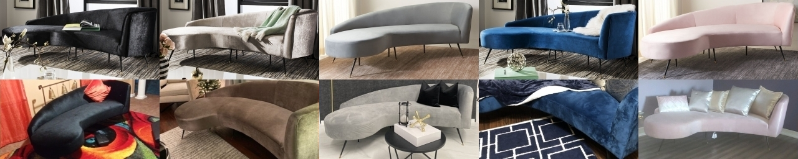
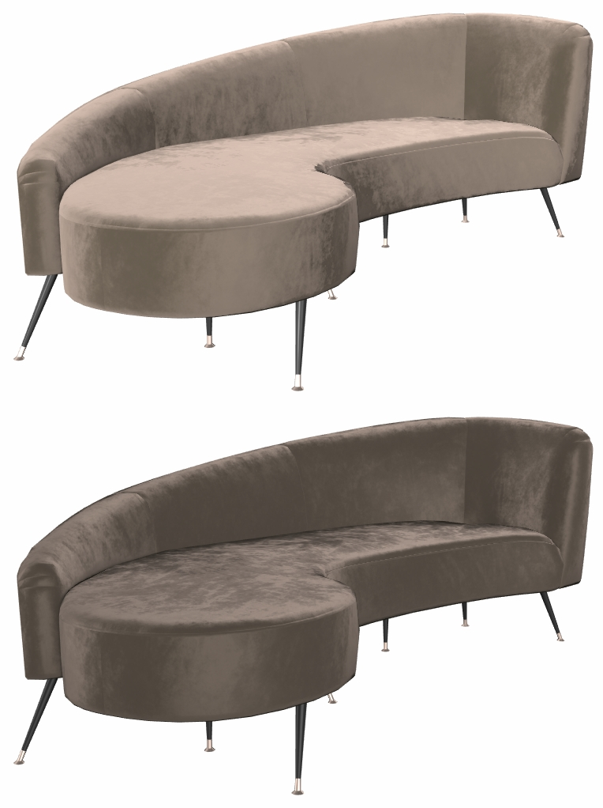

# GlamVelvetSofa

## Screenshot

Above: screenshot from the [Babylon.js Sandbox](https://sandbox.babylonjs.com/).

## Description

This model represents a real product, a velvet sofa bed being sold [on the Wayfair website](https://www.wayfair.com/furniture/pdp/mercer41-frankie-velvet-86-recessed-arm-sofa-bed-mcrf6337.html). 

The model is made of three parts, each with their own materials. Two 1024x1024 PNG textures are used for the whole model, an ambient occlusion map and a normal bump map. All UVs are arranged between 0 and 1, and `KHR_texture_transform` is used to repeat the normal map for the fabric. The model uses 4319 triangles and 3204 vertices.

The model uses several extensions: 
* [KHR_lights_punctual](https://github.com/KhronosGroup/glTF/tree/master/extensions/2.0/Khronos/KHR_lights_punctual) to provide a key light for better velvet illumination. Sheen seems to respond better to punctual lights than with image-based lighting alone.
* [KHR_materials_sheen](https://github.com/KhronosGroup/glTF/blob/master/extensions/2.0/Khronos/KHR_materials_sheen) for perpendicular-angle velvet sheen.
* [KHR_materials_specular](https://github.com/KhronosGroup/glTF/pull/1719) to colorize facing-angle reflections, which some velvets do.
* [KHR_materials_variants](https://github.com/KhronosGroup/glTF/blob/master/extensions/2.0/Khronos/KHR_materials_variants/README.md) to represent the five fabric color options on this product.
* [KHR_texture_transform](https://github.com/KhronosGroup/glTF/blob/master/extensions/2.0/Khronos/KHR_texture_transform/README.md) to scale the normal bump texture across the fabric, separately from the ambient occlusion texture.

## Reference Photos

The use of real-world photographic reference is meant to help glTF developers with calibrating material features and renderer behavior, so we can more accurately represent e-commerce products. Additional photo reference is available [on the Wayfair website](https://www.wayfair.com/furniture/pdp/mercer41-frankie-velvet-86-recessed-arm-sofa-bed-mcrf6337.html).

The official photos of the product are retouched to emphasize materials and finishes, a common practice in retail photography. This can make the materials difficult to reproduce in the glTF model, as it's tricky to isolate accurate base colors, roughness, specular color, etc. Sometimes a physical sample of the surface is difficult to obtain, and proscribing controlled photography is often onerous for manufacturers.

Fortunately, we can rely customer-uploaded photos on the Wayfair website to provide alternative material references. Although lighting can be poor, customer photos are usually minimally-processed which can offer a less-biased view of the surface materials. The ground truth is usually somewhere in the middle, since the official photography provides higher resolution and controlled lighting, while the customer imagery provides little or no retouching.

Photo references of the product. Top row: official product photography, bottom row: customer review photography

## KHR_materials_variants

The model uses the extension [KHR_materials_variants](https://github.com/KhronosGroup/glTF/blob/master/extensions/2.0/Khronos/KHR_materials_variants/README.md) to add five fabric variants:
* Black
* Champagne
* Gray
* Navy
* Pale Pink

## KHR_materials_sheen and KHR_materials_specular

The extension [KHR_materials_sheen](https://github.com/KhronosGroup/glTF/blob/master/extensions/2.0/Khronos/KHR_materials_sheen) is used for the main fabric color; it best represents how velvet microfibers interact with lighting at glancing angles.

To create deep contrast for the darker-colored variants, the `baseColorFactor` is kept very dark. 

[KHR_materials_specular](https://github.com/KhronosGroup/glTF/pull/1719) is used to colorize reflections on dielectric (non-metal) surfaces. Velvet, satin, silk, and similar fabrics can colorize reflections which makes them difficult to replicate in a traditional PBR metal-rough material. 

Top to bottom: base color alone, sheen color added, specular color added.

## KHR_lights_punctual

The extension [KHR_lights_punctual](https://github.com/KhronosGroup/glTF/tree/master/extensions/2.0/Khronos/KHR_lights_punctual) is used to add a directional light to the model, with its Intensity set to 3. This provides better velvet illumination, as sheen responds better to punctual lights than to image-based lighting (IBL) alone. 

This is highly dependent on the exposure range in each IBL, however most IBLs do not capture strong exposure values for the lights unless the sun or a suitably bright light source are present. In these examples, the "studio" IBL from Babylon.js was used, which uses +2.40 stops for each light. 

Augmented reality IBLs typically contain a low value range, as they're often created by transforming the view from the mobile device's front camera. It is hoped the addition of a punctual light can restore the benefits of strong key light to improve the sheen response. 

Top: Punctual light improves sheen. Bottom: Disabling the punctual light.

## Authoring Details ##

The model was created with [3ds Max](https://www.autodesk.com/products/3ds-max/) and exported to glTF via the [Max2Babylon](https://github.com/BabylonJS/Exporters/tree/master/3ds%20Max) exporter. The glTF file was then edited manually in [Visual Studio Code](https://code.visualstudio.com) with the [glTF Tools](https://github.com/AnalyticalGraphicsInc/gltf-vscode) extension to add KHR extensions and fine-tune material values.

## License Information

(C) 2021, Wayfair LLC. CC-BY 4.0 International https://creativecommons.org/licenses/by/4.0/. 
