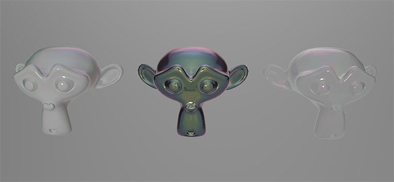

# Iridescence Suzanne

## Screenshot

## Description

A scene with three copies of Suzanne to showcase how the `KHR_materials_iridescence` extension interacts with different base materials.

* Left: Dielectric base material with thin-film layer of constant thickness.
* Center: Metallic base material with thin-film layer of constant thickness.
* Right: Transmissive base material with thin-film layer of varying thickness.

## License Information

Public domain ([CC0](https://creativecommons.org/publicdomain/zero/1.0/))
