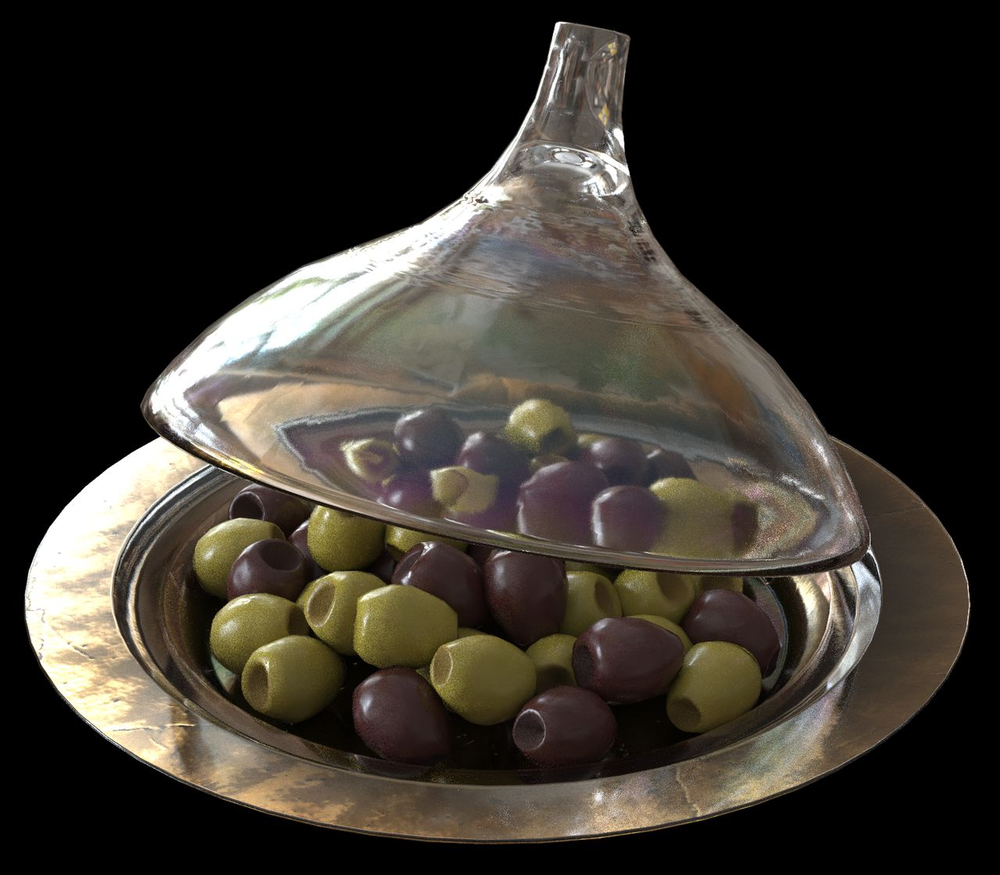
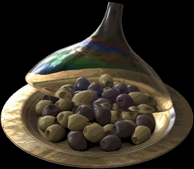
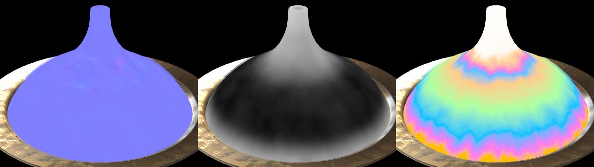
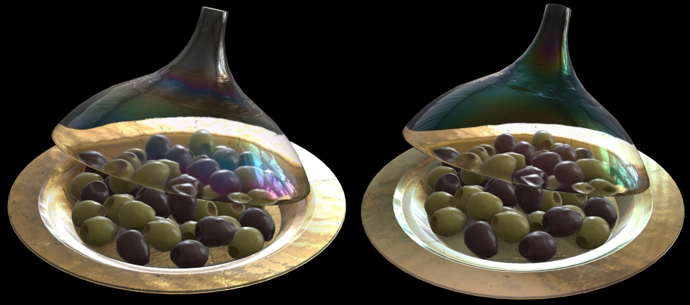
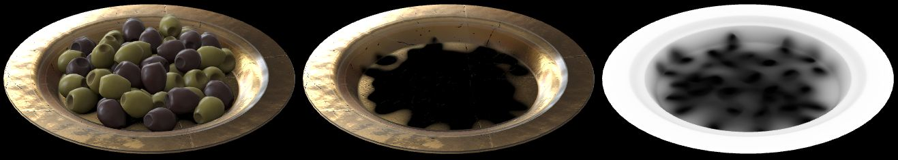

# Iridescent Dish with Olives

## Screenshots

(above) [glTF Sample Viewer](https://github.khronos.org/glTF-Sample-Viewer-Release/) screenshot, with the [Artist Workshop HDRI](https://polyhaven.com/a/artist_workshop) from [Poly Haven](https://polyhaven.com/).

(above) Pathtraced render using the [Dassault Systèmes Enterprise PBR Sample Renderer](https://dassaultsystemes-technology.github.io/dspbr-pt/).

## Description

This model represents a real Wayfair product, an [Olive 21 fl oz. Covered Dish](https://www.wayfair.com/kitchen-tabletop/pdp/bloomsbury-market-olive-21-fl-oz-covered-dish-w001802862.html?piid=1661795386) which has a glass cover with an iridescent glaze, and a glass dish with the same glaze and gold leaf applied to the underside. 

The use of real-world photographic reference is meant to help glTF developers with calibrating material features and renderer behavior to more accurately represent e-commerce products. Additional photo reference is available [on the Wayfair website](https://www.wayfair.com/kitchen-tabletop/pdp/bloomsbury-market-olive-21-fl-oz-covered-dish-w001802862.html?piid=1661795386).

(above) Photos of the real product.

## Animation

The glassCover has an animation to rotate downward and back up, revealing the olives inside and showcasing the refraction and iridescent effects on the glass.

## glassCover Material

The glassCover material uses [KHR_materials_iridescence](https://github.com/KhronosGroup/glTF/pull/2027) to reproduce the colored reflections from the glaze, and [KHR_materials_ior](https://github.com/KhronosGroup/glTF/tree/master/extensions/2.0/Khronos/KHR_materials_ior) and [KHR_materials_transmission](https://github.com/KhronosGroup/glTF/tree/master/extensions/2.0/Khronos/KHR_materials_transmission) and [KHR_materials_volume](https://github.com/KhronosGroup/glTF/tree/master/extensions/2.0/Khronos/KHR_materials_volume) for refraction. 

The colors are caused by a type of glaze called [carnival glass](http://www.ddoty.com/newcomers.html). On the real product the glaze is applied to the inside of the glass cover rather than the outside. However because most rasterizers render only a single layer of transmission, the iridescent colors were applied to both inside and outside of the cover rather than only on the inside.

Refraction is simulated using a `thicknessTexture` that guides rasterizers to render the top part of the glass cover with a deeper refraction. This texture is ignored by pathtracers which use the actual thickness of the geometry rather than the thickness texture. A noise pattern has been added to the thickness to reproduce the wavy refractions seen in photos.

(above) Ingredients for the glassCover material. Top row: final render, normalTexture, thicknessTexture. Bottom row: iridescenceTexture, iridescenceThicknessTexture, and the iridescence effect isolated.

To improve the overall dispersion in pathtracers, the inside surface of the glassCover has been assigned a separate roughness from the outside. On the outside the roughnessFactor is 0.1 while on the inside it is 0.0. This helps renderers to avoid over-roughening the glass, because pathtracers can calculate the roughness on each boundary between glass and air, while rasterizers typically only calculate the roughness for whatever surface is nearest to the camera. 

## Iridescence vs. Specular

Previously this asset used [KHR_materials_specular](https://github.com/KhronosGroup/glTF/tree/master/extensions/2.0/Khronos/KHR_materials_specular) to attempt to reproduce the colored specularity of the glaze. More recently `KHR_materials_iridescence` has become available so the materials have been converted from specular to iridescence. This is a more accurate representation of the glaze on the glass.

(above) The old model using specular (left) versus the current model with iridescence (right).

## glassDish and goldLeaf Materials

The glass dish uses a glass material with `KHR_materials_iridescence` for the colored glaze, and the bottom of the dish has gold leaf applied. Both surfaces use explicit geometry for front and back faces because the back side of each surface is visible behind the other material: from above the gold leaf is visible under the glass, and from below the glass can be seen through cracks in the gold leaf.

The gold leaf uses `"alphaMode":"MASK"` for the cracks instead of `KHR_materials_transmission` because most rasterizers render only a single layer of transmission. If transmission was used, the gold leaf would be invisible under the glass when viewed from above. 

## Olives

Olives have been added to assist in judging refraction and occlusion. 

The upper surfaces of the glassDish and goldLeaf use a texture for precomputed ambient occlusion which simulates how the olives occlude lighting on the surfaces below them. Rasterizers may use this texture to occlude the IBL, while pathtracers will ignore the texture and calculate the occlusion themselves.

(above) Olives on the plate, olives hidden, and the ambient occlusion texture alone.

## Creation Details

The asset was created using [3ds Max](https://www.autodesk.com/products/3ds-max), exported to glTF using [Max2Babylon](https://github.com/BabylonJS/Exporters#babylonjs-exporters), and materials were edited in [Visual Studio Code](https://code.visualstudio.com/) with [glTF Tools](https://github.com/AnalyticalGraphicsInc/gltf-vscode#gltf-tools-extension-for-visual-studio-code).

## License Information

Copyright 2021 Wayfair LLC. CC BY 4.0 International https://creativecommons.org/licenses/by/4.0/
