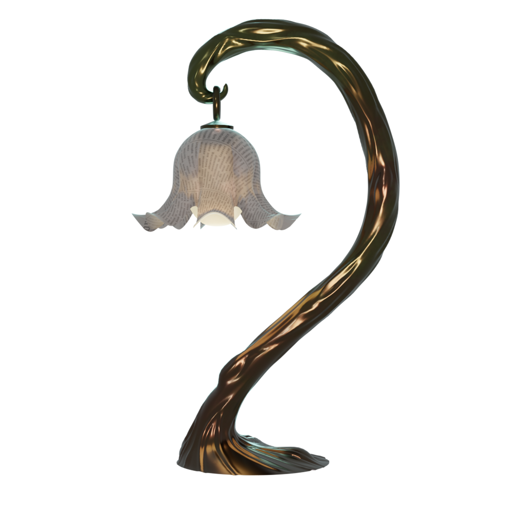
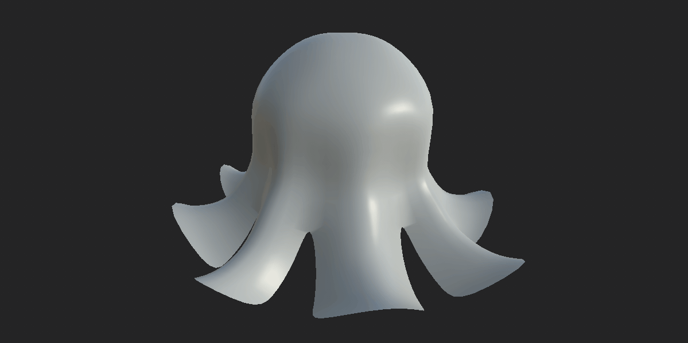
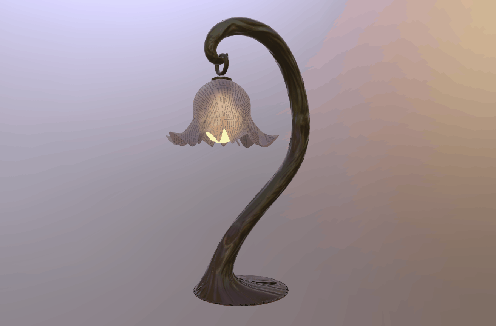

# Lamp using KHR_lights_punctual Extension

## Screenshots

## Description

This originally designed model is inspired by the elegant Maitland Smith lamps. Recycled materials were chosen for the design in order to make the lamp sustainable and appropriate for the current times. The glTF model contains 5 meshes and 6 materials, which make use of the extensions [KHR_materials_transmission](https://github.com/KhronosGroup/glTF/tree/main/extensions/2.0/Khronos/KHR_materials_transmission) and [KHR_lights_punctual](https://github.com/KhronosGroup/glTF/tree/main/extensions/2.0/Khronos/KHR_lights_punctual).

The lamp’s shade uses several textures in order to get the “paper-like” look. Besides the printed text texture, a base color grunge noise has been implemented in order to make the paper look old by faking microsurface refractions. The paper material logically uses the KHR_materials_transmission extension.

The addition of lights into the scene through the KHR_lights_punctual extension is especially meaningful, in that being a light source is the main characteristic of lamps. The use of lights also enhances the use of KHR_materials_transmission in the shade.

## Creation Details

Model created using [Blender](https://www.blender.org/) and [Gestaltor](https://gestaltor.io/) by [Teresa González Viegas](https://www.artstation.com/teresagviegas). Optimized with [RapidCompact](https://rapidcompact.com/).

## License Information

Copyright 2021 DGG. CC BY 4.0 International https://creativecommons.org/licenses/by/4.0/
