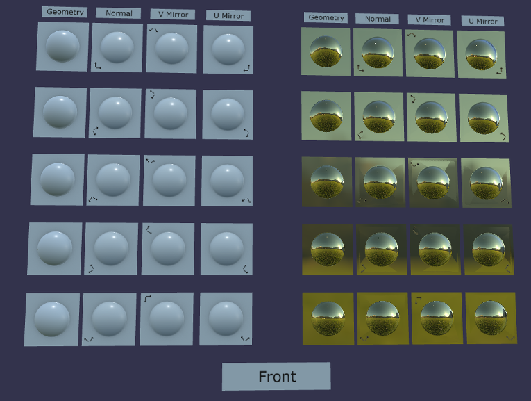
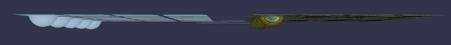
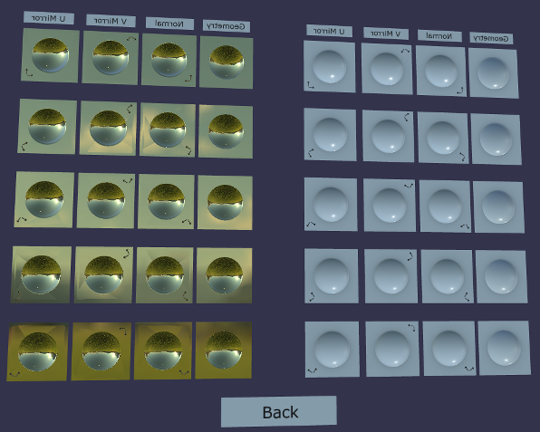
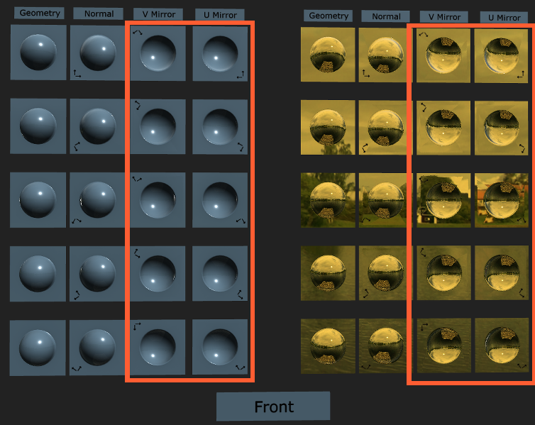
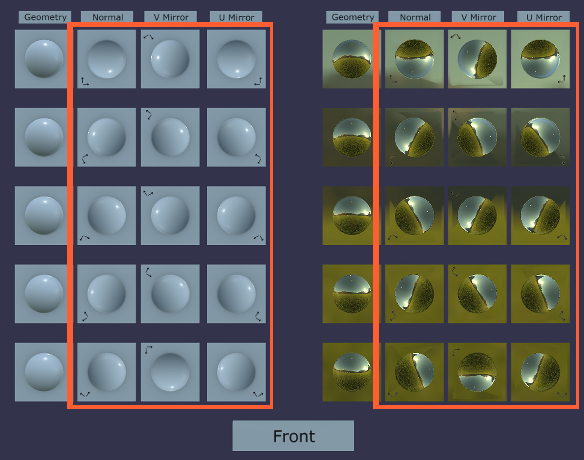

# Normal-Tangent Mirror Test

## Screenshot

## Description

This model compares normal maps of various orientations to actual geometry, to test if the model's supplied tangent vectors are being imported and used correctly.  Note that this model (`NormalTangentMirrorTest`) supplies tangent vectors, and specifically tests a rendering engine's ability to use the supplied vectors as opposed to generating them automatically.  To test automatic generation of tangent vectors, see [`NormalTangentTest`](../NormalTangentTest/README.md).

This test is best performed with an environment map that contains a clear horizon line, so it is easy to spot if the reflection of the horizon is level.  The screenshot above shows a successful render of this model from the front.  All of the test blocks show similar reflections.

## Top Down

Viewing off-axis, such as top-down in this case, breaks the illusion provided by normal-mapping.  From this angle, the viewer can see the difference between real geometry on the left test cells, and normal-mapped quads on the rest.  Normal-mapping works best when viewed face-on.

## Back Side

The back of the model shows concave geometry and normal maps, like looking into a set of mirror-bowls.  It is expected to see the sky below the ground in the reflections.  Above is a correct rendering of the back.

## Problem: Supplied Tangent Vectors Not Used

The above image was taken in a different rendering engine with a different environment map, but the results should still be clear.  A red border has been added for emphasis on the incorrect results.  Here, the horizon line appears level in all the test blocks, but the two "Mirror" sets of tests show inverted reflections, as if seen from the back instead of the front.

This problem is typically caused by a rendering engine that ignores the supplied tangent vectors and calculates its own.  Without the supplied tangent vectors, the engine does not know that the geometry has been mirrored from the original normal-mapped column, and it calculates an inverted set of axes for the reflection vectors.

## Problem: Flipped Y Axis (or flipped green channel)

In the above image, note the test cells on the right three blocks of each set.  A red border has been added for emphasis on the incorrect results.  Here, the real geometry reflects level horizon lines, but the normal-mapped geometry appears to reflect several different orientations.

This is a common problem, that often indicates the rendering engine has mis-interpreted the direction of the normal Y vector, supplied by the green channel of the normal map.  Some systems intentionally use or expect left-handed normal maps, however, glTF [specifies](https://github.com/KhronosGroup/glTF/tree/065a01206014cd5f198085de6b4ce6f565ae79c6/specification/2.0#materialnormaltexture) that its own normal maps should use the OpenGL convention with right-handed coordinates.  This issue can often be fixed by flipping the normal Y vector, or inverting the intensity of the green channel of the normal map.  Fixes should be applied such that glTF models contain only the specified OpenGL normal convention, and rendering engines automatically adapt this to their own internal convention as needed.

## License Information

Copyright 2017-2018 Analytical Graphics, Inc.
CC-BY 4.0 https://creativecommons.org/licenses/by/4.0/
Model and textures by Ed Mackey.
