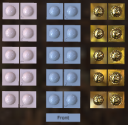

# Normal-Tangent Test

## Screenshot

## Description

This model compares normal maps of various orientations to actual geometry, to test if tangent vectors are being calculated and handled correctly.

## License Information

Copyright 2017 Analytical Graphics, Inc.
CC-BY 4.0 https://creativecommons.org/licenses/by/4.0/
Model and textures by Ed Mackey.
