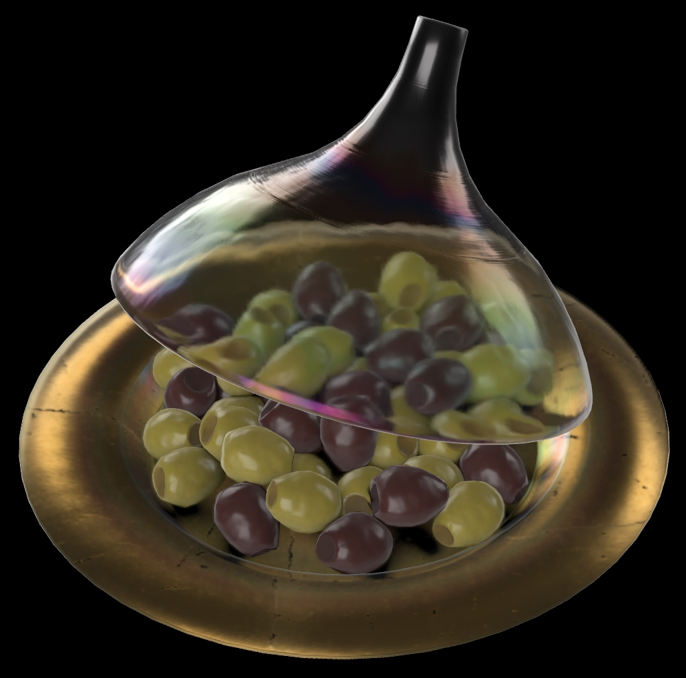
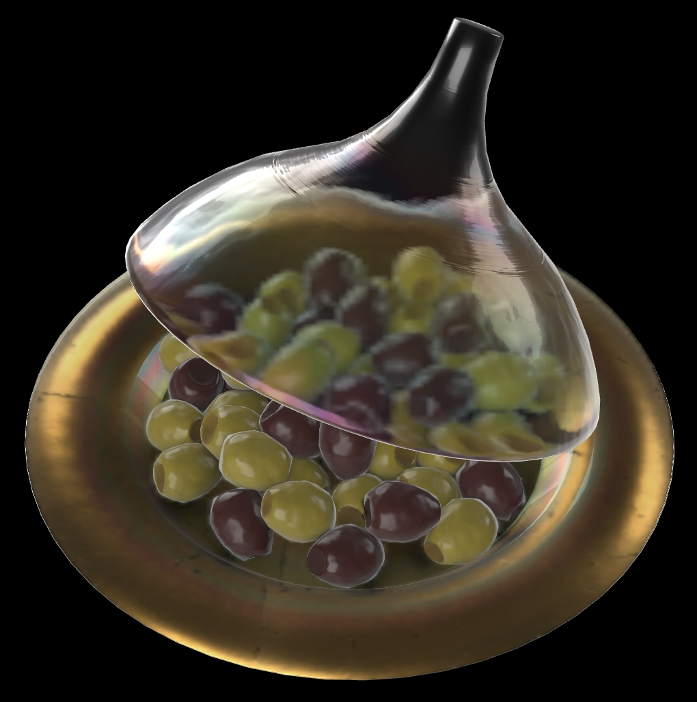
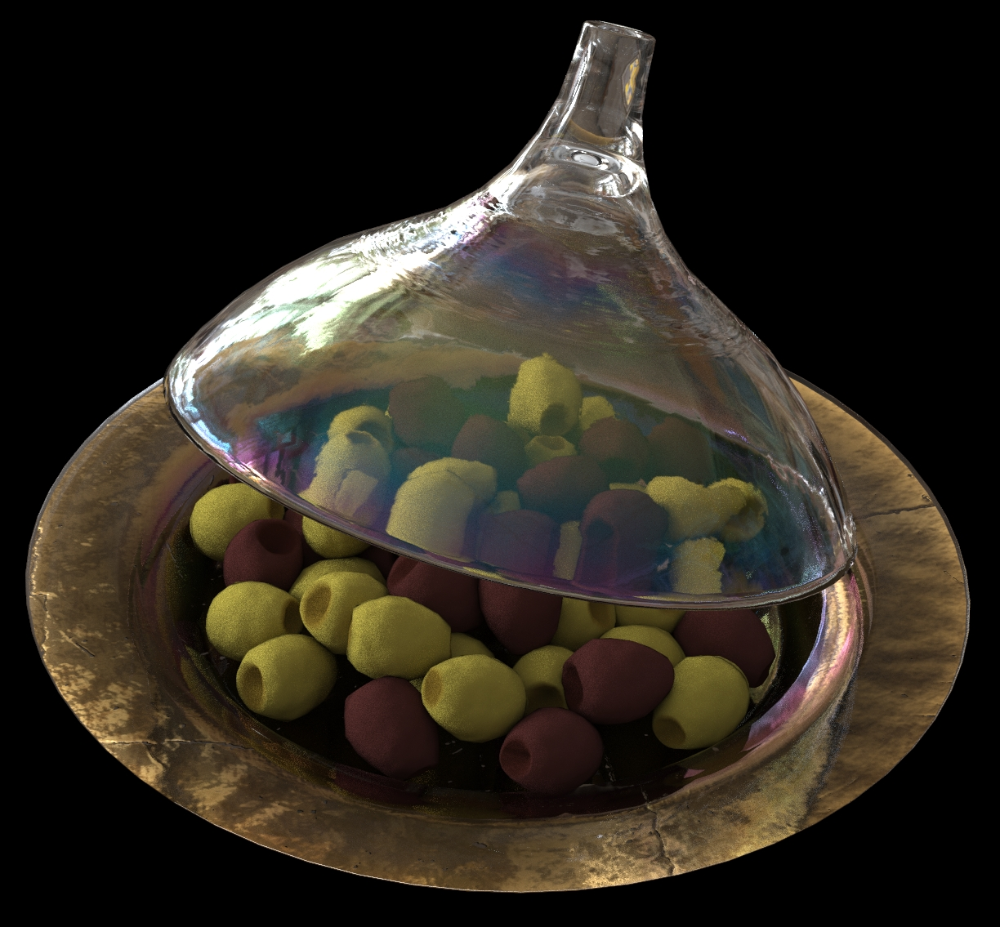
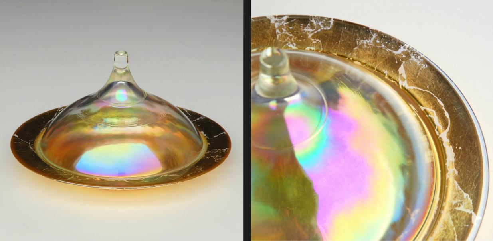
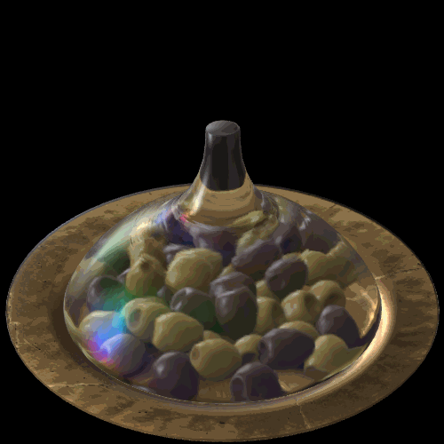
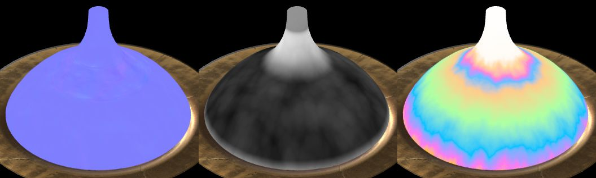
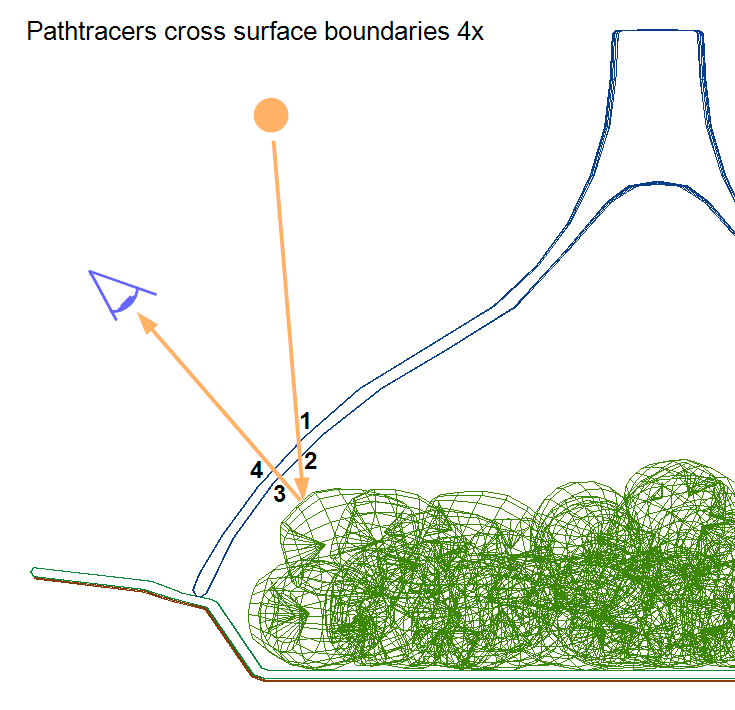

# PearlGoldOliveCoveredGlassDish 

## Screenshots

(above) [Babylon.js Sandbox](https://sandbox.babylonjs.com/) screenshot, with the [Artist Workshop HDRI](https://hdrihaven.com/hdri/?h=artist_workshop) from [HDRI Haven](https://hdrihaven.com/).

(above) [glTF Sample Viewer](https://github.khronos.org/glTF-Sample-Viewer-Release/) screenshot.

(above) Pathtraced render using the [Dassault PBR Sample Renderer](https://dassaultsystemes-technology.github.io/dspbr-pt/).

## Description

This model represents a real Wayfair product, an [Olive 21 fl oz. Covered Dish](https://www.wayfair.com/kitchen-tabletop/pdp/bloomsbury-market-olive-21-fl-oz-covered-dish-w001802862.html?piid=1661795386), which has a glass cover with an iridescent glaze, and a glass dish with the same glaze and gold leaf applied to the underside. 

The use of real-world photographic reference is meant to help glTF developers with calibrating material features and renderer behavior, to more accurately represent e-commerce products. Additional photo reference is available [on the Wayfair website](https://www.wayfair.com/kitchen-tabletop/pdp/bloomsbury-market-olive-21-fl-oz-covered-dish-w001802862.html?piid=1661795386).

(above) Photos of the real product.

## Animation

The glassCover has an animation to rotate upward and back, revealing the olives inside, showcasing the refraction and specular effects on the glass.

## glassCover Material

The glassCover material uses [KHR_materials_specular](https://github.com/KhronosGroup/glTF/tree/master/extensions/2.0/Khronos/KHR_materials_specular) to reproduce the colored specularity of the glaze, and [KHR_materials_ior](https://github.com/KhronosGroup/glTF/tree/master/extensions/2.0/Khronos/KHR_materials_ior) and [KHR_materials_transmission](https://github.com/KhronosGroup/glTF/tree/master/extensions/2.0/Khronos/KHR_materials_transmission) and [KHR_materials_volume](https://github.com/KhronosGroup/glTF/tree/master/extensions/2.0/Khronos/KHR_materials_volume) for refraction. 

The specular colors are caused by a type of glaze called [carnival glass](http://www.ddoty.com/newcomers.html). On the real product the glaze is applied to the inside of the glass cover rather than the outside. However because most rasterizers render only a single layer of transmission, the specular colors were applied to both inside and outside of the cover rather than only on the inside.

Refraction is simulated using a `thicknessTexture` that guides rasterizers to render the top part of the glass cover with a deeper refraction. This texture is ignored by pathtracers which use the actual thickness of the geometry rather than the thickness texture. A noise pattern has been added to the thickness to reproduce the wavy refractions seen in photos.

(above) Textures for the glassCover material: normalTexture, thicknessTexture, specularColorTexture.

## glassDish and goldLeaf Materials

The glass dish uses a glass material with `KHR_materials_specular` for the colored glaze, and the bottom of the dish has gold leaf applied. Both surfaces use explicit geometry for front and back faces because the back side of each surface is visible behind the other material: from above the gold leaf is visible under the glass, and from below the glass can be seen through cracks in the goldleaf.

The dish glass material omits `KHR_materials_ior` or `KHR_materials_volume` because it was preferred to have less distortion of the gold leaf visible underneath the glass. 

The gold leaf uses `"alphaMode":"MASK"` for the cracks instead of `KHR_materials_transmission` because most rasterizers render only a single layer of transmission. If transmission was used, the gold leaf would be invisible under the glass when viewed from above. 

## Olives

Olives have been added to assist in judging refraction and occlusion. 

The upper surfaces of the glassDish and goldLeaf use a precomputed ambient occlusion texture which simulates how the olives occlude lighting on the surfaces below them. Rasterizers may use this texture to occlude the IBL, while pathtracers will calculate the occlusion themselves.

(above) Olives on the plate, olives hidden, and the ambient occlusion texture alone.

## glTF-Pathtracer

A variation has been added for use with pathtracers, with adjusted materials. 

* glassCover roughnessFactor reduced.
* normalTextures adjusted to use "scale":1
* Animation removed, and glassCover rotated upwards slightly.

In most rasterizers the roughness is applied only once. However in a pathtracer when a light ray is traced between a light source and the camera, the ray crosses four boundaries between air and glass; it is essentially hitting the glass four times. This increases the apparent roughness of the glass, making the glass more blurry than intended. 

Additionally, pathtracers usually ignore the scale parameter for normalTextures, so the textures have been adjusted to work well with the default strength value. The same textures are reused for the rasterizer version so scale values have been adjusted in the rasterizer glTF to look good in those types of renderers. 

 

## Creation Details

The asset was created using [3ds Max](https://www.autodesk.com/products/3ds-max), exported to glTF using [Max2Babylon](https://github.com/BabylonJS/Exporters#babylonjs-exporters), and materials were edited in [Visual Studio Code](https://code.visualstudio.com/) with [glTF Tools](https://github.com/AnalyticalGraphicsInc/gltf-vscode#gltf-tools-extension-for-visual-studio-code).

## License Information

Copyright 2021 Wayfair LLC. CC BY 4.0 International https://creativecommons.org/licenses/by/4.0/
