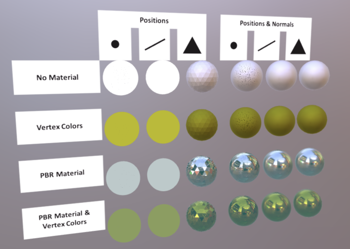

# Primitive Mode Normals Test

## Screenshot

## Description

This asset tests rendering of point, line, and triangle primitive modes with and without vertex normals.

- The first two columns, points and lines without normals, should be rendered as solid colors without lighting.

- The third column, triangles without normals, should be rendered with flat shading and full PBR material model.

- The remaining columns, all three modes with normals, should be rendered with smooth shading and full PBR material model.

## License Information

Public domain ([CC0](https://creativecommons.org/publicdomain/zero/1.0/))
