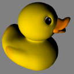
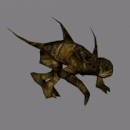
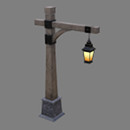

# glTF 2.0 Sample Models

## Simple models for testing individual features

| Model                                                  | Screenshot                                                      | Description |
|--------------------------------------------------------|-----------------------------------------------------------------|-------------|
| [Triangle Without Indices](TriangleWithoutIndices)     |            | The simplest possible glTF asset: A single `scene` with a single `node` and a single `mesh` with a single `mesh.primitive` with a single triangle with a single attribute, without indices and without a `material` |
| [Triangle](Triangle)                                   |                          | A very simple glTF asset: The basic structure is the same as in [Triangle Without Indices](TriangleWithoutIndices), but here, the `mesh.primitive` describes an *indexed* geometry
| [Animated Triangle](AnimatedTriangle)                  |                  | This sample is similar to the [Triangle](Triangle), but the `node` has a `rotation` property that is modified with a simple `animation` |
| [Animated Morph Cube](AnimatedMorphCube)               |                 | Demonstrates a simple cube with two simple morph targets and an animation that transitions between them both. |
| [Animated Morph Sphere](AnimatedMorphSphere)           |               | This sample is similar to the [Animated Morph Cube](AnimatedMorphCube), but the two morph targets move many more vertices and are more extreme than with the cube. |
| [Simple Meshes](SimpleMeshes)                          |                      | A simple `scene` with two `nodes`, both containing the same `mesh`, namely a `mesh` with a single `mesh.primitive` with a single indexed triangle with *multiple* attributes (positions, normals and texture coordinates), but without a `material` |
| [Simple Morph](SimpleMorph)                            |                       | A triangle with a morph animation applied |
| [Simple Sparse Accessor](SimpleSparseAccessor)         |              | A simple mesh that uses sparse accessors |
| [Cameras](Cameras)                                     |                           | A sample with two different `camera` objects |
| [Interpolation Test](InterpolationTest)                |                 | A sample with three different `animation` interpolations |

## More complex models

| Model                                         | Screenshot                                       | Description |
|-----------------------------------------------|--------------------------------------------------|-------------|
| [Box](Box)                                    |                | One mesh and one material. Start with this. |
| [Box Interleaved](BoxInterleaved)             |     | Box example with interleaved position and normal attributes. |
| [Box Textured](BoxTextured)                   |        | Box with one texture. Start with this to test textures. |
| [Box Textured NPOT](BoxTexturedNonPowerOfTwo) |  | Box with a non-power-of-2 (NPOT) texture.  Not all implementations support NPOT textures. |
| [Box Vertex Colors](BoxVertexColors)          |    | Box with vertex colors applied. |
| [Duck](Duck)                                  |               | The COLLADA duck. One texture. |
| [2 Cylinder Engine](2CylinderEngine)          |    | Small CAD data set, including hierarchy. |
| [Reciprocating Saw](ReciprocatingSaw)         |   | Small CAD data set, including hierarchy. |
| [Gearbox Assy](GearboxAssy)                   |        | Medium-sized CAD data set, including hierarchy. |
| [Buggy](Buggy)                                |              | Medium-sized CAD data set, including hierarchy |
| [Box Animated](BoxAnimated)                   |        | Rotation and Translation Animations. Start with this to test animations. |
| [Cesium Milk Truck](CesiumMilkTruck)          |    | Textured. Multiple nodes/meshes. Animations. |
| [Rigged Simple](RiggedSimple)                 |       | Animations. Skins. Start with this to test skinning. |
| [Rigged Figure](RiggedFigure)                 |       | Animations. Skins. |
| [Cesium Man](CesiumMan)                       |          | Textured. Animations. Skins. |
| [Monster](Monster)                            |            | Textured. Animations. Skins. |
| [BrainStem](BrainStem)                        |          | Animations. Skins. |
| [Virtual City](VC)                            |                 | Textured. Animations. Skins. |
| [Sponza](Sponza)                              |             | Building interior, often used to test lighting. |

## PBR models

| Model                                         | Screenshot                                       | Normal Map         | Occlusion Map      | Emissive Map       |
|-----------------------------------------------|:------------------------------------------------:|:------------------:|:------------------:|:------------------:|
| [Avocado](Avocado)                            |            | :white_check_mark: |                    |                    |
| [Barramundi Fish](BarramundiFish)             |     | :white_check_mark: | :white_check_mark: |                    |
| [Boom Box](BoomBox)                           |            | :white_check_mark: | :white_check_mark: | :white_check_mark: |
| [Corset](Corset)                              |             | :white_check_mark: | :white_check_mark: |                    |
| [Damaged Helmet](DamagedHelmet)               |      | :white_check_mark: | :white_check_mark: | :white_check_mark: |
| [Flight Helmet](FlightHelmet)                 |       | :white_check_mark: | :white_check_mark: |                    |
| [Lantern](Lantern)                            |            | :white_check_mark: | :white_check_mark: | :white_check_mark: |
| [Water Bottle](WaterBottle)                   |        | :white_check_mark: | :white_check_mark: | :white_check_mark: |

## Further PBR models

| Model                                                  | Screenshot                                                      | Description |
|--------------------------------------------------------|-----------------------------------------------------------------|-------------|
| [Two Sided Plane](TwoSidedPlane)                       |                     | A plane having the two sided material parameter enabled.       |
| [Cube](Cube)                                           |                              | A cube with non-smoothed faces.                                |
| [Animated Cube](AnimatedCube)                          |                      | Same as previous cube having a linear rotation animation.      |
| [Suzanne](Suzanne)                                     |                           | Suzanne from Blender with smoothed faces.                      |
| [Sci Fi Helmet](SciFiHelmet)                           |                       | Sci Fi Helmet having unsigned integer indices.                 |
| [Antique Camera](AntiqueCamera)                        |                     | Old camera model having various materials.                       |

## Feature Test Models

| Model                                                 | Screenshot                                                    | Description |
|-------------------------------------------------------|---------------------------------------------------------------|-------------|
| [Alpha Blend Mode Test](AlphaBlendModeTest)           |              | Tests alpha modes and settings. |
| [Boom Box With Axes](BoomBoxWithAxes)                 |                 | Shows X, Y, and Z axis default orientations. |
| [Metal Rough Spheres](MetalRoughSpheres)              |               | Tests various metal and roughness values (texture mapped). |
| [Metal Rough Spheres (Textureless)](MetalRoughSpheresNoTextures) |  | Tests various metal and roughness values (textureless). |
| [Morph Primitives Test](MorphPrimitivesTest)          |             | Tests a morph target on multiple primitives. |
| [Multi UV Test](MultiUVTest)                          |                     | Tests a second set of texture coordinates. |
| [Normal Tangent Test](NormalTangentTest)              |               | Tests an engine's ability to automatically generate tangent vectors for a normal map. |
| [Normal Tangent Mirror Test](NormalTangentMirrorTest) |         | Tests an engine's ability to load supplied tangent vectors for a normal map. |
| [Orientation Test](OrientationTest)                   |                 | Tests node translations and rotations. |
| [Texture Coordinate Test](TextureCoordinateTest)      |           | Shows how XYZ and UV positions relate to displayed geometry. |
| [Texture Settings Test](TextureSettingsTest)          |             | Tests single/double-sided and various texturing modes. |
| [Vertex Color Test](VertexColorTest)                  |                 | Tests if vertex colors are supported. |

## Extension Test Models

| Model                                                 | Screenshot                                                    | Description |
|-------------------------------------------------------|---------------------------------------------------------------|-------------|
| [Environment Test](EnvironmentTest)                   |                 | A simple `scene` with metal and dielectric spheres that range between 0 and 1 roughness. Useful for testing environment lighting. |
| [SpecGloss Vs MetalRough](SpecGlossVsMetalRough)      |           | Tests if the KHR_materials_pbrSpecularGlossiness extension is supported properly. |
| [Texture Transform Test](TextureTransformTest)        |            | Tests if the KHR_texture_transform extension is supported properly. |
| [Unlit Test](UnlitTest)                               |                       | Tests if the KHR_materials_unlit extension is supported properly. |
