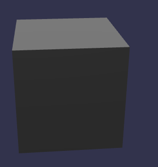
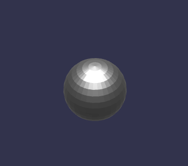
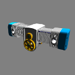
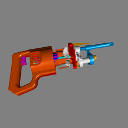
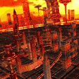
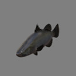

# glTF 2.0 Sample Models

## Simple models for testing individual features

| Model                                                  | Screenshot                                                      | Description|
|--------------------------------------------------------|-----------------------------------------------------------------|------------|
| [Triangle Without Indices](TriangleWithoutIndices)     |            | The simplest possible glTF asset: A single `scene` with a single `node` and a single `mesh` with a single `mesh.primitive` with a single triangle with a single attribute, without indices and without a `material` |
| [Triangle](Triangle)                                   |                          | A very simple glTF asset: The basic structure is the same as in [Triangle Without Indices](TriangleWithoutIndices), but here, the `mesh.primitive` describes an *indexed* geometry
| [Animated Triangle](AnimatedTriangle)                  |                  | This sample is similar to the [Triangle](Triangle), but the `node` has a `rotation` property that is modified with a simple `animation` |
| [Animated Morph Cube](AnimatedMorphCube)               |                 | Demonstrates a simple cube with two simple morph targets and an animation that transitions between them both. |
| [Animated Morph Sphere](AnimatedMorphSphere)           |               | This sample is similar to the [Animated Morph Cube](AnimatedMorphCube), but the two morph targets move many more vertices and are more extreme than with the cube. |
| [Simple Meshes](SimpleMeshes)                          |                      | A simple `scene` with two `nodes`, both containing the same `mesh`, namely a `mesh` with a single `mesh.primitive` with a single indexed triangle with *multiple* attributes (positions, normals and texture coordinates), but without a `material` |
| [Cameras](Cameras)                                     |                           | A sample with two different `camera` objects |

## More complex models

| Model                                         | Screenshot                                       | Description|
|-----------------------------------------------|--------------------------------------------------|------------|
| [Box](Box)                                    |                | One mesh and one material. Start with this. |
| [Box Textured](BoxTextured)                   |        | Box with one texture. Start with this to test textures. |
| [Duck](Duck)                                  |               | The COLLADA duck. One texture. |
| [Smiling Face](SmilingFace)                   |        | A smiling face with multiple textures. |
| [2 Cylinder Engine](2CylinderEngine)          |    | Small CAD data set, including hierarchy. |
| [Reciprocating Saw](ReciprocatingSaw)         |   | Small CAD data set, including hierarchy. |
| [Gearbox Assy](GearboxAssy)                   |        | Medium-sized CAD data set, including hierarchy. |
| [Buggy](Buggy)                                |              | Medium-sized CAD data set, including hierarchy |
| [Box Animated](BoxAnimated)                   |        | Rotation and Translation Animations. Start with this to test animations. |
| [Cesium Milk Truck](CesiumMilkTruck)          |    | Textured. Multiple nodes/meshes. Animations. |
| [Rigged Simple](RiggedSimple)                 |       | Animations. Skins. Start with this to test skinning. |
| [Rigged Figure](RiggedFigure)                 |       | Animations. Skins. |
| [Walking Lady](WalkingLady)                   |        | Animations. Skins. |
| [Cesium Man](CesiumMan)                       |          | Textured. Animations. Skins. |
| [Monster](Monster)                            |            | Textured. Animations. Skins. |
| [BrainStem](BrainStem)                        |          | Animations. Skins. |
| [Virtual City](VC)                            |                 | Textured. Animations. Skins. |

## PBR models

| Model                             | Screenshot                                       | Normal Map         | Occlusion Map      | Emissive Map       |
|-----------------------------------|:------------------------------------------------:|:------------------:|:------------------:|:------------------:|
| [Avocado](Avocado)                |            | :white_check_mark: | :white_check_mark: |                    |
| [Barramundi Fish](BarramundiFish) |     | :white_check_mark: | :white_check_mark: |                    |
| [Boom Box](BoomBox)               |            | :white_check_mark: | :white_check_mark: | :white_check_mark: |
| [Corset](Corset)                  |             | :white_check_mark: | :white_check_mark: |                    |
| [Lantern](Lantern)                |            | :white_check_mark: | :white_check_mark: | :white_check_mark: |
| [MetalRoughSpheres](MetalRoughSpheres)  |    |                    |                    |                    |
| [NormalTangentTest](NormalTangentTest)  |    | :white_check_mark: |                    |                    |

## Further PBR models

| Model                                                  | Screenshot                                                      | Description|
|--------------------------------------------------------|-----------------------------------------------------------------|------------|
| [Two Sided Plane](TwoSidedPlane)                       |                     | A plane having the two sided material parameter enabled.       |
| [Cube](Cube)                                           |                              | A cube with non-smoothed faces.                                |
| [Animated Cube](AnimatedCube)                          |                      | Same as previous cube having a linear rotation animation.      |
| [Suzanne](Suzanne)                                     |                           | Suzanne from Blender with smoothed faces.                      |
| [Sci Fi Helmet](SciFiHelmet)                           |                       | Sci Fi Helmet having unsigned integer indices.                 |
