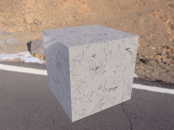
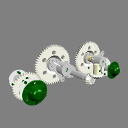
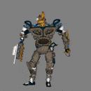
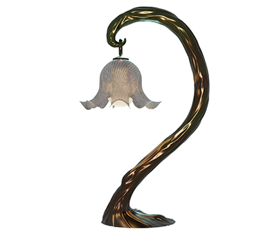
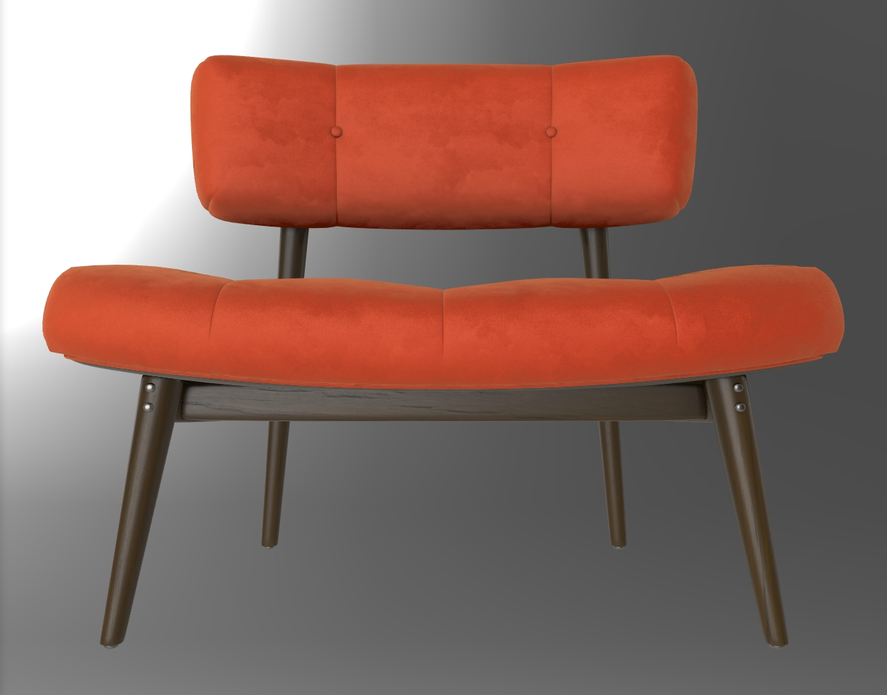

# glTF 2.0 Sample Models

* [Core](#core)
    * [Showcase](#showcase)
    * [Feature Tests](#feature-tests)
    * [Standard](#standard)
    * [Minimal](#minimal)
* [Extensions](#extensions)
    * [Showcase](#showcase-1)
    * [Feature Tests](#feature-tests-1)

## Core

Models demonstrating features of the core glTF specification. Some models may include versions with extensions, e.g. copies with or without Draco compression.

### Showcase

| Model                                         | Screenshot                                       | Normal Map         | Occlusion Map      | Emissive Map       |
|-----------------------------------------------|:------------------------------------------------:|:------------------:|:------------------:|:------------------:|
| [Antique Camera](AntiqueCamera)               |      | :white_check_mark: |                    |                    |
| [Avocado](Avocado)                            |            | :white_check_mark: |                    |                    |
| [Barramundi Fish](BarramundiFish)             |     | :white_check_mark: | :white_check_mark: |                    |
| [Boom Box](BoomBox)                           |            | :white_check_mark: | :white_check_mark: | :white_check_mark: |
| [Corset](Corset)                              |             | :white_check_mark: | :white_check_mark: |                    |
| [Damaged Helmet](DamagedHelmet)               |      | :white_check_mark: | :white_check_mark: | :white_check_mark: |
| [Flight Helmet](FlightHelmet)                 |       | :white_check_mark: | :white_check_mark: |                    |
| [Lantern](Lantern)                            |            | :white_check_mark: | :white_check_mark: | :white_check_mark: |
| [Sci Fi Helmet](SciFiHelmet)                  |        | :white_check_mark: | :white_check_mark: |                    |
| [Suzanne](Suzanne)                            |            |                    |                    |                    |
| [Water Bottle](WaterBottle)                   |        | :white_check_mark: | :white_check_mark: | :white_check_mark: |

### Standard

Standard models demonstrating multiple features of the core specification.

| Model                                         | Screenshot                                       | Description |
|-----------------------------------------------|--------------------------------------------------|-------------|
| [Box](Box)                                    |                | One mesh and one material. Start with this. |
| [Box Interleaved](BoxInterleaved)             |     | Box example with interleaved position and normal attributes. |
| [Box Textured](BoxTextured)                   |        | Box with one texture. Start with this to test textures. |
| [Box Textured NPOT](BoxTexturedNonPowerOfTwo) |  | Box with a non-power-of-2 (NPOT) texture.  Not all implementations support NPOT textures. |
| [Box With Spaces](Box%20With%20Spaces)        |  | Box with URI-encoded spaces in the texture names used by a simple PBR material. |
| [Box Vertex Colors](BoxVertexColors)          |    | Box with vertex colors applied. |
| [Cube](Cube)                                  |               | A cube with non-smoothed faces. |
| [Animated Cube](AnimatedCube)                 |       | Same as previous cube having a linear rotation animation. |
| [Duck](Duck)                                  |               | The COLLADA duck. One texture. |
| [2 Cylinder Engine](2CylinderEngine)          |    | Small CAD data set, including hierarchy. |
| [Reciprocating Saw](ReciprocatingSaw)         |   | Small CAD data set, including hierarchy. |
| [Gearbox Assy](GearboxAssy)                   |        | Medium-sized CAD data set, including hierarchy. |
| [Buggy](Buggy)                                |              | Medium-sized CAD data set, including hierarchy |
| [Box Animated](BoxAnimated)                   |        | Rotation and Translation Animations. Start with this to test animations. |
| [Cesium Milk Truck](CesiumMilkTruck)          |    | Textured. Multiple nodes/meshes. Animations. |
| [Rigged Simple](RiggedSimple)                 |       | Animations. Skins. Start with this to test skinning. |
| [Rigged Figure](RiggedFigure)                 |       | Animations. Skins. |
| [Cesium Man](CesiumMan)                       |          | Textured. Animations. Skins. |
| [BrainStem](BrainStem)                        |          | Animations. Skins. |
| [Fox](Fox)                                    |                | Multiple animations cycles: Survey, Walk, Run. |
| [Virtual City](VC)                            |                 | Textured. Animations. |
| [Sponza](Sponza)                              |             | Building interior, often used to test lighting. |
| [Two Sided Plane](TwoSidedPlane)              |      | A plane having the two sided material parameter enabled. |

### Feature Tests

Models meant to easily illustrate and test specific features of the core specification.

| Model                                                 | Screenshot                                                    | Description |
|-------------------------------------------------------|---------------------------------------------------------------|-------------|
| [Alpha Blend Mode Test](AlphaBlendModeTest)           |              | Tests alpha modes and settings. |
| [Boom Box With Axes](BoomBoxWithAxes)                 |                 | Shows X, Y, and Z axis default orientations. |
| [Metal Rough Spheres](MetalRoughSpheres)              |               | Tests various metal and roughness values (texture mapped). |
| [Metal Rough Spheres (Textureless)](MetalRoughSpheresNoTextures) |  | Tests various metal and roughness values (textureless). |
| [Morph Primitives Test](MorphPrimitivesTest)          |             | Tests a morph target on multiple primitives. |
| [Morph Stress Test](MorphStressTest)                  |                 | Tests up to 8 morph targets. |
| [Multi UV Test](MultiUVTest)                          |                     | Tests a second set of texture coordinates. |
| [Negative Scale Test](NegativeScaleTest)              |               | Tests what happens when geometry is mirrored. |
| [Normal Tangent Test](NormalTangentTest)              |               | Tests an engine's ability to automatically generate tangent vectors for a normal map. |
| [Normal Tangent Mirror Test](NormalTangentMirrorTest) |         | Tests an engine's ability to load supplied tangent vectors for a normal map. |
| [Orientation Test](OrientationTest)                   |                 | Tests node translations and rotations. |
| [Recursive Skeletons](RecursiveSkeletons)             |              | Tests unusual skinning cases with reused meshes and recursive skeletons. |
| [Texture Coordinate Test](TextureCoordinateTest)      |           | Shows how XYZ and UV positions relate to displayed geometry. |
| [Texture Linear Interpolation Test](TextureLinearInterpolationTest) |  | Tests that linear texture interpolation is performed on linear values, i.e. after sRGB decoding. |
| [Texture Settings Test](TextureSettingsTest)          |             | Tests single/double-sided and various texturing modes. |
| [Vertex Color Test](VertexColorTest)                  |                 | Tests if vertex colors are supported. |

### Minimal Tests

Minimal models testing very narrow pieces of the core specification.

| Model                                                  | Screenshot                                                      | Description |
|--------------------------------------------------------|-----------------------------------------------------------------|-------------|
| [Triangle Without Indices](TriangleWithoutIndices)     |            | The simplest possible glTF asset: A single `scene` with a single `node` and a single `mesh` with a single `mesh.primitive` with a single triangle with a single attribute, without indices and without a `material` |
| [Triangle](Triangle)                                   |                          | A very simple glTF asset: The basic structure is the same as in [Triangle Without Indices](TriangleWithoutIndices), but here, the `mesh.primitive` describes an *indexed* geometry
| [Animated Triangle](AnimatedTriangle)                  |                  | This sample is similar to the [Triangle](Triangle), but the `node` has a `rotation` property that is modified with a simple `animation` |
| [Animated Morph Cube](AnimatedMorphCube)               |                 | Demonstrates a simple cube with two simple morph targets and an animation that transitions between them both. |
| [Animated Morph Sphere](AnimatedMorphSphere)           |               | This sample is similar to the [Animated Morph Cube](AnimatedMorphCube), but the two morph targets move many more vertices and are more extreme than with the cube. |
| [Simple Meshes](SimpleMeshes)                          |                      | A simple `scene` with two `nodes`, both containing the same `mesh`, namely a `mesh` with a single `mesh.primitive` with a single indexed triangle with *multiple* attributes (positions, normals and texture coordinates), but without a `material` |
| [Multiple Scenes](MultipleScenes)                      |                    | A simple glTF asset with two scenes. Each scene consists of one node with one mesh. For the first scene, the mesh is a triangle. For the second scene, the mesh is a square. The default scene is set to `1` by the `scene` property, so viewers should initially show the scene containing the square. 
| [Simple Morph](SimpleMorph)                            |                       | A triangle with a morph animation applied |
| [Simple Sparse Accessor](SimpleSparseAccessor)         |              | A simple mesh that uses sparse accessors |
| [Simple Skin](SimpleSkin)                              |                        | A simple example of vertex skinning in glTF
| [Cameras](Cameras)                                     |                           | A sample with two different `camera` objects |
| [Interpolation Test](InterpolationTest)                |                 | A sample with three different `animation` interpolations |
| [Unicode Test](Unicode❤♻Test)                         |                    | A sample with Unicode characters in file, material, and mesh names |

## Extensions

Models demonstrating features of extensions to the glTF specification. See glTF [extension registry](https://github.com/KhronosGroup/glTF/blob/main/extensions/README.md) for a list of available extensions.

### Showcase

| Model                              | Screenshot                                            | Description |
|------------------------------------|-------------------------------------------------------|-------------|
| [A Beautiful Game](ABeautifulGame) |  | Chess set using [transmission](https://github.com/KhronosGroup/glTF/tree/main/extensions/2.0/Khronos/KHR_materials_transmission) and [volume](https://github.com/KhronosGroup/glTF/tree/main/extensions/2.0/Khronos/KHR_materials_volume). |
| [Dragon Attenuation](DragonAttenuation) |  | Dragon with background, using [material variants](https://github.com/KhronosGroup/glTF/tree/main/extensions/2.0/Khronos/KHR_materials_variants), [transmission](https://github.com/KhronosGroup/glTF/tree/main/extensions/2.0/Khronos/KHR_materials_transmission), and [volume](https://github.com/KhronosGroup/glTF/tree/main/extensions/2.0/Khronos/KHR_materials_volume). |
| [Glam Velvet Sofa](GlamVelvetSofa) |          | Sofa using [material variants](https://github.com/KhronosGroup/glTF/tree/main/extensions/2.0/Khronos/KHR_materials_variants), [sheen](https://github.com/KhronosGroup/glTF/tree/main/extensions/2.0/Khronos/KHR_materials_sheen), and [specular](https://github.com/KhronosGroup/glTF/tree/main/extensions/2.0/Khronos/KHR_materials_specular). |
| [Iridescence Lamp](IridescenceLamp) |  | Wayfair Lamp model using [transmission](https://github.com/KhronosGroup/glTF/tree/main/extensions/2.0/Khronos/KHR_materials_transmission), [volume](https://github.com/KhronosGroup/glTF/tree/main/extensions/2.0/Khronos/KHR_materials_volume), and KHR_materials_iridescence. |
| [Iridescent Dish with Olives](IridescentDishWithOlives) |  | Dish using [transmission](https://github.com/KhronosGroup/glTF/tree/main/extensions/2.0/Khronos/KHR_materials_transmission), [volume](https://github.com/KhronosGroup/glTF/tree/main/extensions/2.0/Khronos/KHR_materials_volume), [IOR](https://github.com/KhronosGroup/glTF/tree/main/extensions/2.0/Khronos/KHR_materials_ior), and [specular](https://github.com/KhronosGroup/glTF/tree/main/extensions/2.0/Khronos/KHR_materials_specular). |
| [Lights Punctual Lamp](LightsPunctualLamp) |  | Lamp using [punctual lights](https://github.com/KhronosGroup/glTF/tree/main/extensions/2.0/Khronos/KHR_lights_punctual). |
| [Materials Variants Shoe](MaterialsVariantsShoe) |  | Shoe using [material variants](https://github.com/KhronosGroup/glTF/tree/main/extensions/2.0/Khronos/KHR_materials_variants). |
| [Mosquito In Amber](MosquitoInAmber) |  | Mosquito in amber by Sketchfab, using [transmission](https://github.com/KhronosGroup/glTF/tree/main/extensions/2.0/Khronos/KHR_materials_transmission), [IOR](https://github.com/KhronosGroup/glTF/tree/main/extensions/2.0/Khronos/KHR_materials_ior), and [volume](https://github.com/KhronosGroup/glTF/tree/main/extensions/2.0/Khronos/KHR_materials_volume). |
| [Sheen Chair](SheenChair)          |              | Chair using [material variants](https://github.com/KhronosGroup/glTF/tree/main/extensions/2.0/Khronos/KHR_materials_variants) and [sheen](https://github.com/KhronosGroup/glTF/tree/main/extensions/2.0/Khronos/KHR_materials_sheen). |
| [Sheen Cloth](SheenCloth)          |              | Fabric example using [sheen](https://github.com/KhronosGroup/glTF/tree/main/extensions/2.0/Khronos/KHR_materials_sheen). |
| [Toy Car](ToyCar)                  |                  | Toy car example using [transmission](https://github.com/KhronosGroup/glTF/tree/main/extensions/2.0/Khronos/KHR_materials_transmission), [clearcoat](https://github.com/KhronosGroup/glTF/tree/main/extensions/2.0/Khronos/KHR_materials_clearcoat), and [sheen](https://github.com/KhronosGroup/glTF/tree/main/extensions/2.0/Khronos/KHR_materials_sheen). |

### Feature Tests

Models meant to easily illustrate and test specific features of extensions to the glTF specification.

| Model                                                     | Screenshot                                                    | Description |
|-----------------------------------------------------------|---------------------------------------------------------------|-------------|
| [Attenuation Test](AttenuationTest)                       |                 | Tests the interactions between attenuation, thickness, and scale. |
| [Clearcoat Test](ClearCoatTest)                           |                   | Tests if the KHR_materials_clearcoat extension is supported properly. |
| [Emissive Strength Test](EmissiveStrengthTest)            |            | Tests if the KHR_materials_emissive_strength extension is supported properly. |
| [Environment Test](EnvironmentTest)                       |                 | A simple `scene` with metal and dielectric spheres that range between 0 and 1 roughness. Useful for testing environment lighting. |
| [Iridescence Dielectric Spheres](IridescenceDielectricSpheres) |  | Tests KHR_materials_iridescence on a non-metallic material. |
| [Iridescence Metallic Spheres](IridescenceMetallicSpheres) |     | Tests KHR_materials_iridescence on a metallic material. |
| [Iridescence Suzanne](IridescenceSuzanne)                 |              | Further tests KHR_materials_iridescence. |
| [SpecGloss Vs MetalRough](SpecGlossVsMetalRough)          |           | Tests if the KHR_materials_pbrSpecularGlossiness extension is supported properly. |
| [Specular Test](SpecularTest)                             |                    | Tests if the KHR_materials_specular extension is supported correctly. |
| [Texture Transform Test](TextureTransformTest)            |            | Tests if the KHR_texture_transform extension is supported for BaseColor. |
| [Texture Transform Multi Test](TextureTransformMultiTest) |       | Tests if the KHR_texture_transform extension is supported for several inputs. |
| [Transmission Roughness Test](TransmissionRoughnessTest)  |       | Tests the interaction between roughness and IOR. |
| [Transmission Test](TransmissionTest)                     |                | Tests if the KHR_materials_transmission extension is supported properly. |
| [Unlit Test](UnlitTest)                                   |                       | Tests if the KHR_materials_unlit extension is supported properly. |
