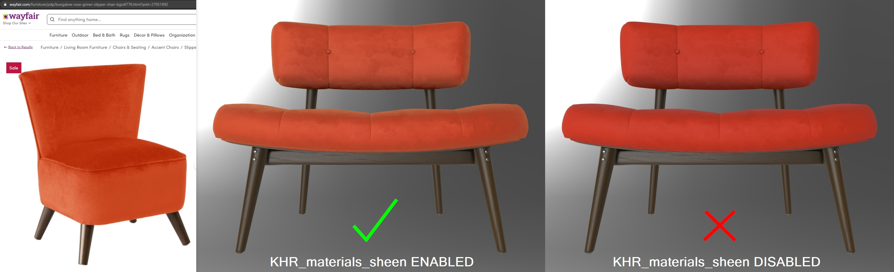
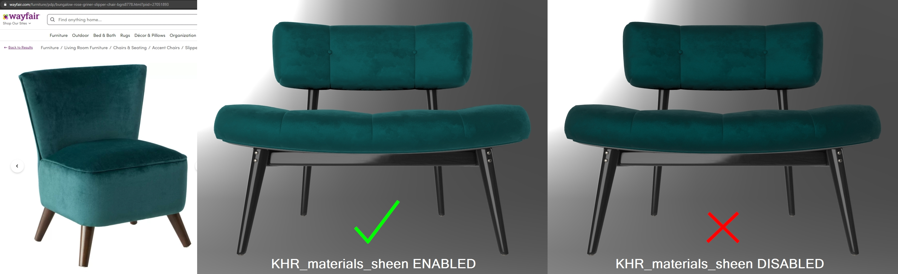

# SheenChair

## Screenshot

[Babylon.JS](https://sandbox.babylonjs.com/) screenshot (above), using the Studio lighting environment.

## Description

This model is a wood-framed chair with a fabric seat, tufted with fabric buttons and metal hardware. It uses three extensions: `KHR_materials_sheen` for velvet fabrics, `KHR_texture_transform` to tile the textures for fabric and  wood, and `KHR_materials_variants` to create two versions of the chair: "Mango Velvet", and "Peacock Velvet". 

The model is made of four parts using subdivision surface modeling, with four materials for fabric, wood, metal, and the label. The ambient occlusion texture is shared by all materials and uses a 2nd UV with all UVs arranged between 0 and 1. All the other textures use the 1st UV which is not so constrained; it has overlaps and the UVs extend outside the 0-1 UV space.

The textures were created uniquely, edited from public domain imagery (https://www.publicdomainpictures.net/), or edited from personal photos. This model does not represent a real product, however the fabrics were modeled to match real fabrics, represented [here on the Wayfair website](https://www.wayfair.com/furniture/pdp/bungalow-rose-griner-slipper-chair-bgrs8778.html). The use of real-world reference is meant to help glTF developers with calibrating material features and renderer handling, so we can more accurately represent e-commerce products. 

## KHR_materials_sheen

The fabric materials use the extension `KHR_materials_sheen` to reproduce velvet fabrics. These screenshots show the real-world photo reference, alongside the intended rendering result, and what may occur if the extension is disabled or not implemented.

Above: real-world reference, and [Babylon.JS](https://sandbox.babylonjs.com/) screenshots using the Studio lighting environment, showing the variant "Mango Velvet" with `KHR_materials_sheen` enabled and disabled.

Above: real-world reference, and [Babylon.JS](https://sandbox.babylonjs.com/) screenshots using the Studio lighting environment, showing the variant "Peacock Velvet" with `KHR_materials_sheen` enabled and disabled.

## Material Authoring Choices

To simulate the bending of velvet microfibers from human handling, the red and green color channels of the normal map have been biased in different directions. The normal map has been reduced in strength using the Scale parameter; if this is disabled the fabric may look too rough and bumpy.

The Peacock Velvet material uses 1.0 metalness. While not being physically accurate, metalness colorizes reflections similarly to real-world velvet fabric, creating more contrast to match the real-world reference. Future extensions may add specular color to metallic-roughness materials for dielectric surfaces, negating the need to force metalness in this case.

## Authoring Software

The model was created in Autodesk 3ds Max 2020 and exported using the [`Max2Babylon`](https://github.com/BabylonJS/Exporters/tree/master/3ds%20Max) exporter. To add `KHR_materials_sheen` and `KHR_materials_variants` the glTF file was edited manually. 

## License Information

Copyright 2020 Wayfair LLC, CC-BY 4.0 https://creativecommons.org/licenses/by/4.0/, model and textures created by Eric Chadwick.
