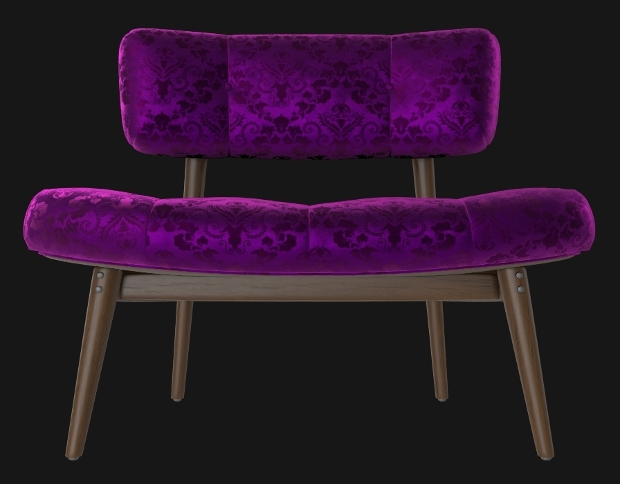
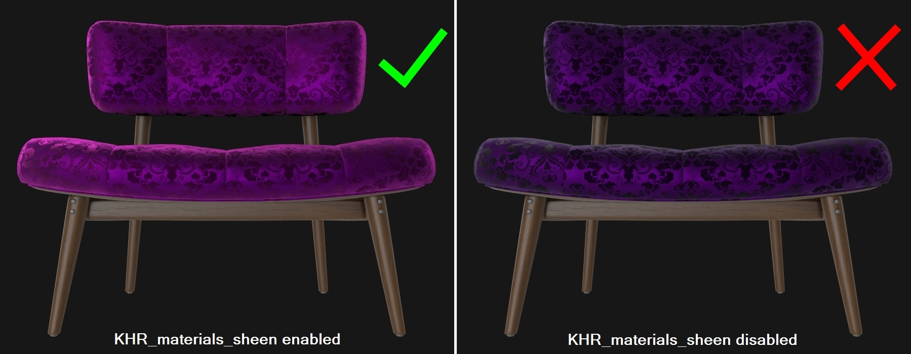
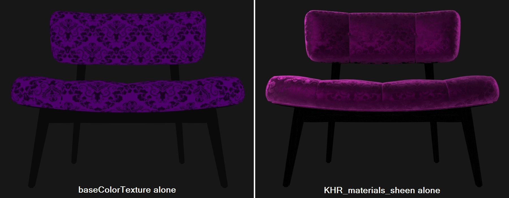
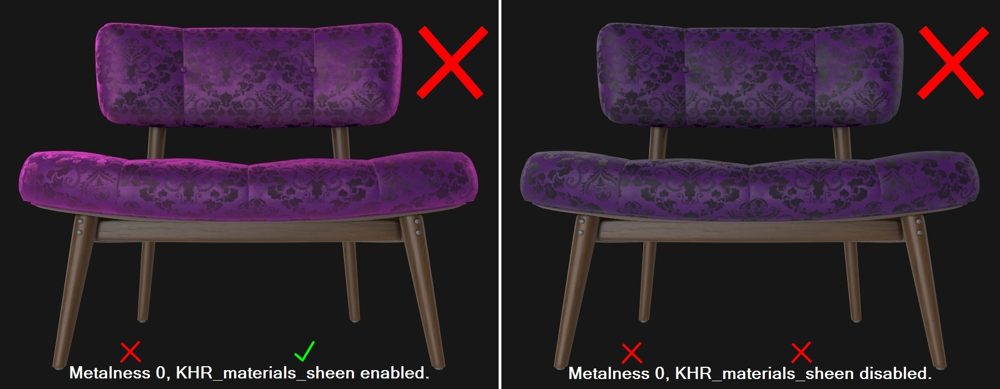

# SheenChair

## Screenshot

[Babylon.JS](https://sandbox.babylonjs.com/) screenshot (above).

## Description

This model uses the extension `KHR_materials_sheen` to demonstrate damask fabric, a combination of velvet and satin. It's a wood-framed chair with a fabric seat, tufted with fabric buttons. 

The model is made of several parts using subdivision surface modeling. There are four materials: fabric, wood, metal, and label. 

The textures were created uniquely, edited from public domain imagery (https://www.publicdomainpictures.net/), or edited from personal photos. This model does not represent a real product. 

## KHR_materials_sheen

The fabric material uses the extension `KHR_materials_sheen`. 

[Babylon.JS](https://sandbox.babylonjs.com/) screenshot (above) shows the model with `KHR_materials_sheen` vs. without.

[Babylon.JS](https://sandbox.babylonjs.com/) screenshot (above) shows the relative contributions of the baseColorTexture and `KHR_materials_sheen`.

To simulate the anisotropic sheens of the two different fabrics, a color bias was added to the normal bump map, bending the red and green color channels in different directions. 

The fabric material uses 1.0 metalness. While not being physically accurate, metalness colorizes reflections similarly to real-world satin and velvet fabric. Future extensions may add specular color to metal-rough materials for dielectric surfaces, negating the need to force metalness in this case.

[Babylon.JS](https://sandbox.babylonjs.com/) screenshot (above) shows the model without Metalness, both with `KHR_materials_sheen` and without.

The model was created in and exported from Autodesk 3ds Max 2018 using the [`Max2Babylon`](https://github.com/BabylonJS/Exporters/tree/master/3ds%20Max) exporter. To enable `KHR_materials_sheen` the glTF file was edited manually. The gltf passes the [glTF Validation](http://github.khronos.org/glTF-Validator/) without errors or warnings, except for an UNSUPPORTED EXTENSION warning for `KHR_materials_sheen` which is not yet supported by the validator. 

## License Information

Copyright 2020 Wayfair LLC, CC-BY 4.0 https://creativecommons.org/licenses/by/4.0/, model and textures by Eric Chadwick.