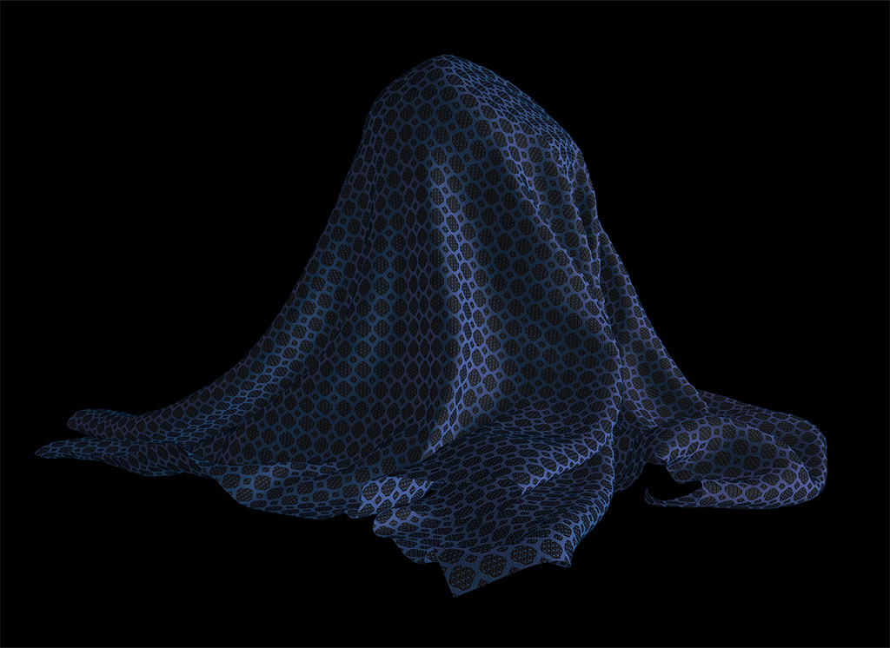
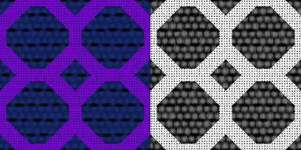

# Sheen Cloth

### Screenshot

### Specifications
The mesh of this asset was created with a cloth simulation in Maya and then subdivided to smooth out the geometry in the folds of the cloth. The frequency of the folds is tied to the resolution of the source mesh, so the mesh in this asset is very heavy to account for more folds as well as a smooth mesh.

To account for this, the material uses tiled textures to reduce the overall size of the texture files. The textures are 256 x 256 pixels and are tiled 30 times in U and V using the KHR_texture_transform extension. The other extension in the file is KHR_materials_sheen to allow for a sheen texture to be used on the model. 

The texture for the technical fabric was created in Substance Designer with a base color texture, packed ORM texture, normal texture, and sheen texture with sheen color in the RGB channels and sheen roughness in alpha. The image below shows the channels of the sheen texture with the left half of the image displaying the sheen color in the RGB channels and the right displaying the sheen roughness in the alpha channel.

 

### License Information

Donated by Microsoft for glTF testing

  
To the extent possible under law, Microsoft has waived all copyright and related or neighboring rights to this asset.
