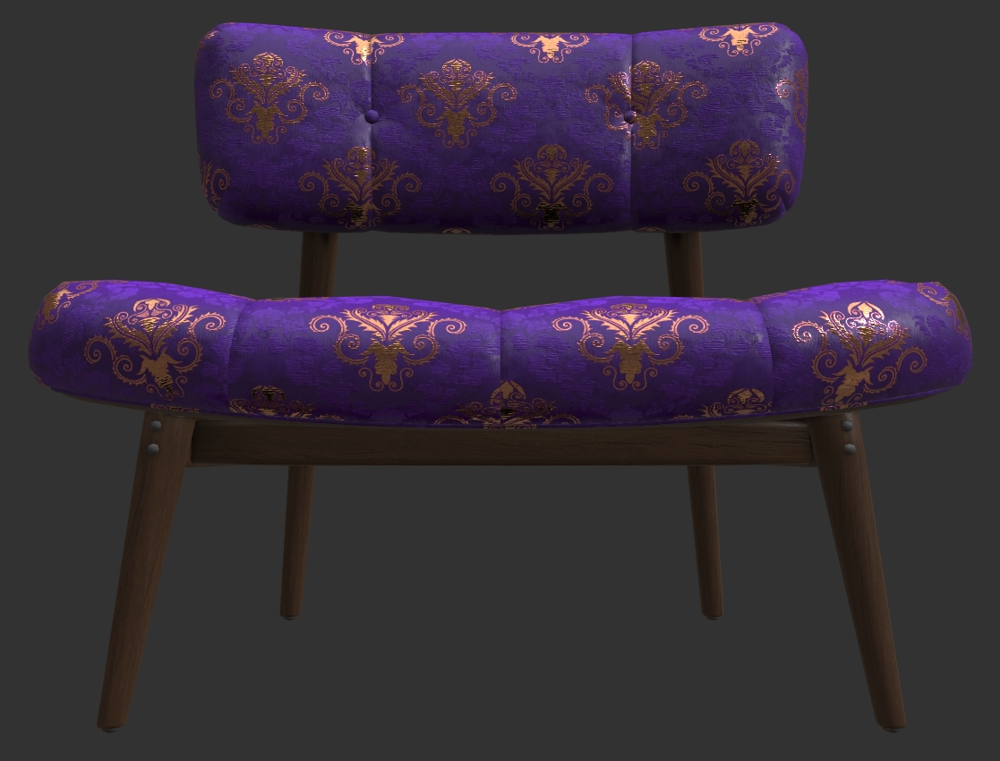
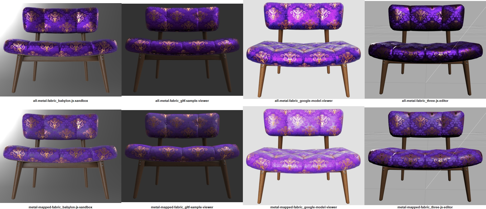
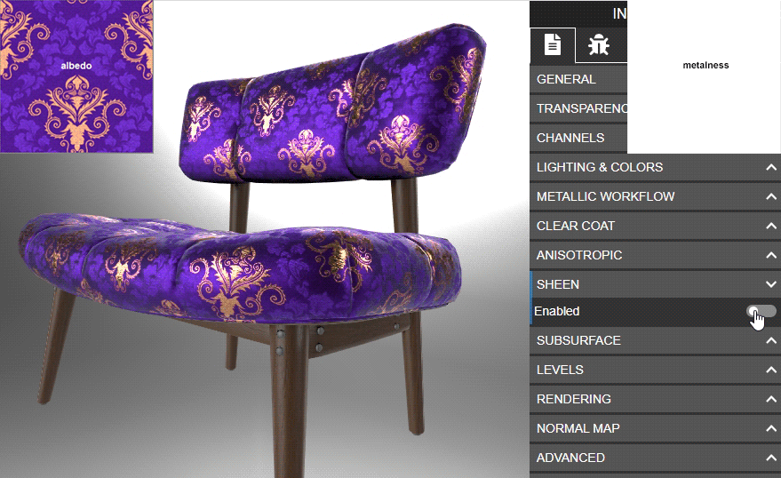
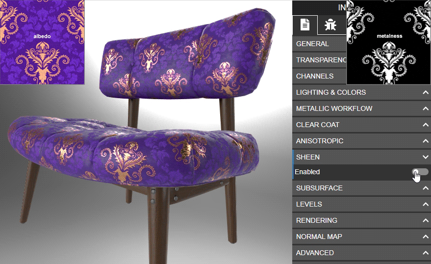
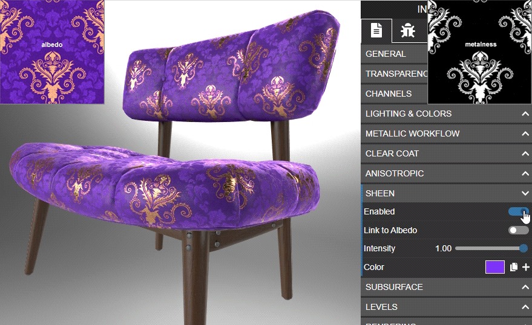

# Chair Damask Purplegold

## Screenshots

Fabric 100% metal, glTF Sample Viewer screenshot:  

Fabric metalness-mapped (gold metallic, purple non-metallic), glTF Sample Viewer screenshot:  

## Description

This represents a wood-framed chair with a fabric seat, tufted with fabric buttons. It does not represent any particular real product. 

There are four materials: fabric, wood, metal, and label. To simulate directional fabric sheens I've added different noise patterns in the color channels of the normal map. 

The asset is provided in both ASCII glTF format, and binary GLB format. Extensions required: KHR_texture_transform. 

## Source Files

The source file for the model is in 3ds Max 2020 format. It uses OpenSubdiv modifiers for easy editing. The model was exported from 3ds Max using the [`Max2Babylon`](https://github.com/BabylonJS/Exporters/tree/master/3ds%20Max) exporter.

## Fabric Material Variants

The fabric has two material variants. 

The first variant uses 100% metallic fabric, so specular reflections are colored similarly to how satin reflects lighting. 

The second variant uses a metalness texture to assign the gold threads as metal and the purple threads as non-metal. 

Viewer comparison screenshots, using default lighting. From left: ['Babylon.JS Sandbox'](https://sandbox.babylonjs.com/), ['glTF Sample Viewer'](http://gltf.ux3d.io/), ['Google model-viewer'](https://modelviewer.dev/examples/tester.html), ['three.js Editor'](https://threejs.org/editor/):  

The all-metal example is a non-physically accurate use of metalness, however it seems to reflect lighting more like real satin. The non-colorized reflection in the second variant does not properly replicate the look of satin; the fabric looks more like plastic.

Real-world satin brocade examples:
* https://www.aliexpress.com/i/32683580523.html?spm=2114.12057483.0.0.2da73132b4vl0O
* https://www.aliexpress.com/i/32826499087.html?spm=2114.12057483.0.0.268d37a9rm9m7K

## Sheen Testing

The asset was loaded in the ['Babylon.JS Sandbox'](https://sandbox.babylonjs.com/) to test their implementation of KHR_materials_sheen. Using a sheen color seems to provide better results than using "Link To Albedo".

Animated GIF to compare Sheen settings using all-metal fabric, in the Babylon.JS Sandbox:  

Animated GIF to compare Sheen settings using metal-mapped fabric (gold metallic, purple non-metallic), in the Babylon.JS Sandbox:  

Animated GIF comparing the two metalness approaches, with single-colored Sheen, in the Babylon.JS Sandbox:  

## License Information

CC-BY 4.0 https://creativecommons.org/licenses/by/4.0/  
Model and textures by Eric Chadwick, Senior Technical Artist, Wayfair.
