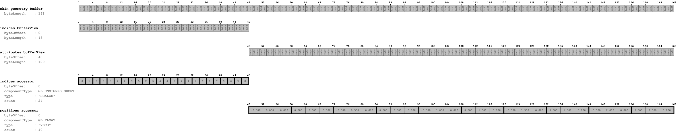
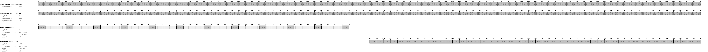
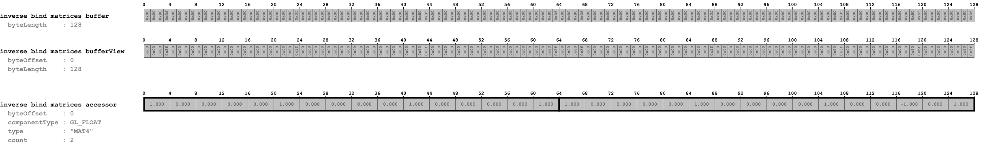
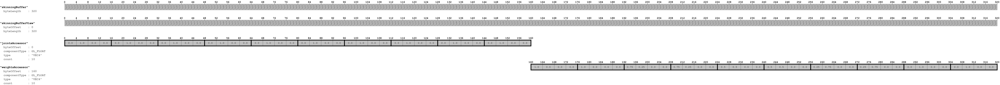

# SimpleSkin

## Under construction! 

Parts of the skinning specification may be changed for glTF 1.1

## Screenshot

## License Information

Public domain ([CC0](https://creativecommons.org/publicdomain/zero/1.0/))

## Data layout

The following images show the data layout of this sample:

