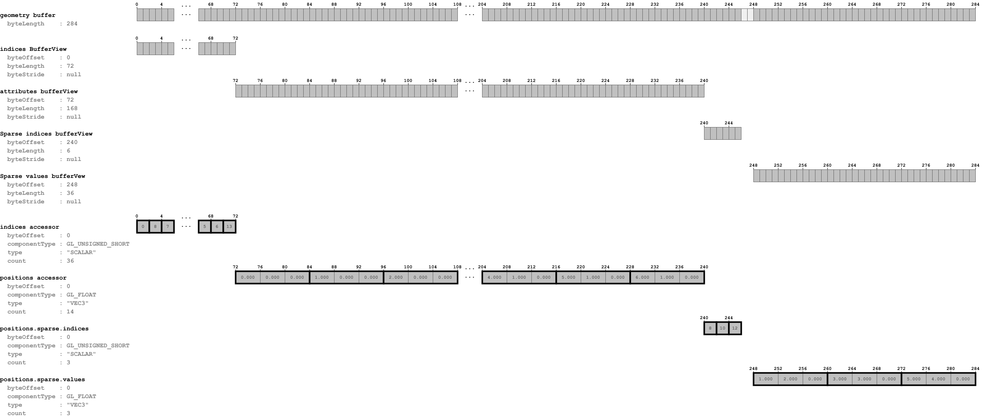
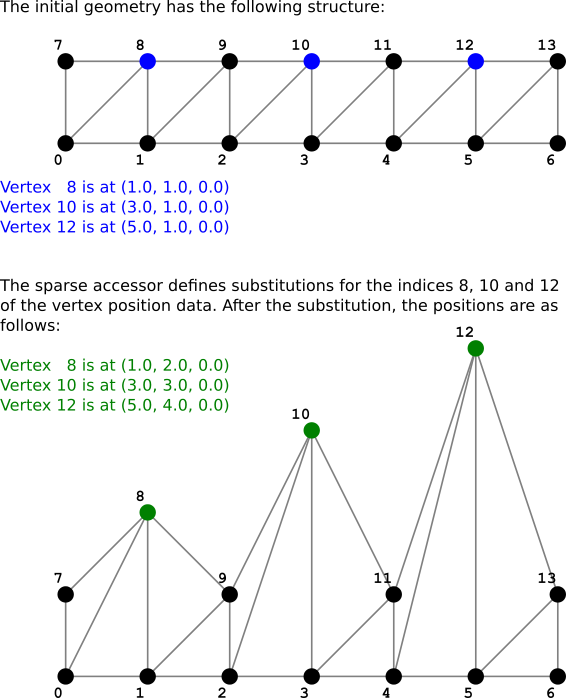

# SimpleSparseAccessor

## Screenshot

## Data layout

The following image shows the data layout of this sample:

## Geometry

The following image shows the substitution of the values that takes place for the sparse accessor:

## License Information

Public domain ([CC0](https://creativecommons.org/publicdomain/zero/1.0/))

