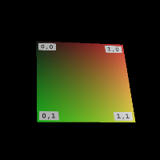
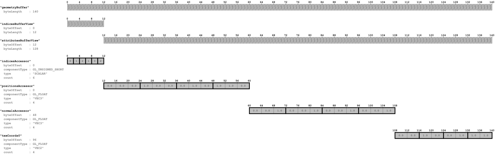

# SimpleTexture

## Screenshot

Note that the texture image also shows the *texture coordinates*:

- The *upper left* point of the texture image has the texture coordinates `(0,0)` 
- The *lower right* point of the texture image has the texture coordinates `(1,1)` 

## License Information

Public domain ([CC0](https://creativecommons.org/publicdomain/zero/1.0/))

## Data layout

The following image shows the data layout of this sample:

