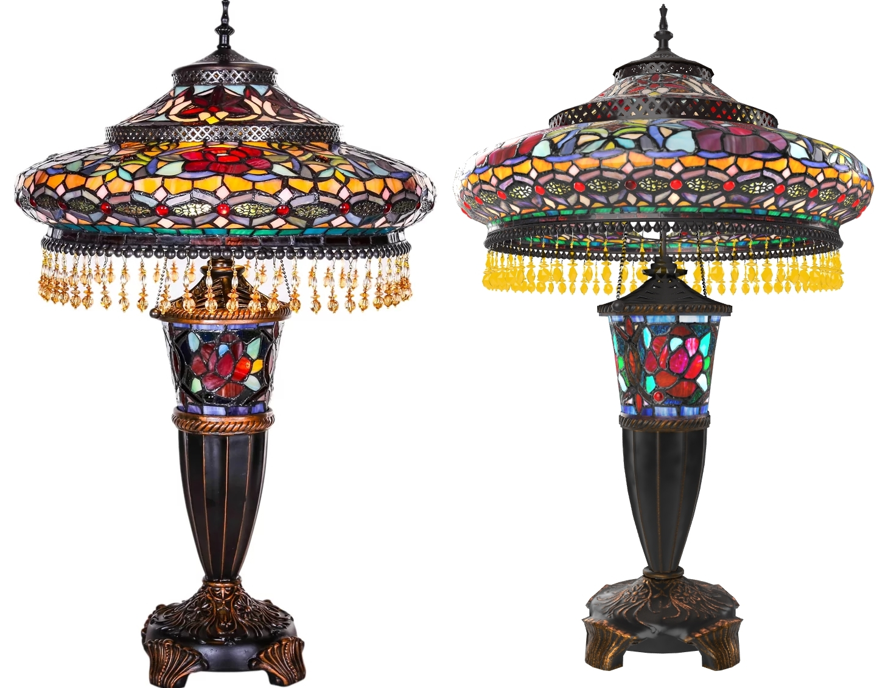
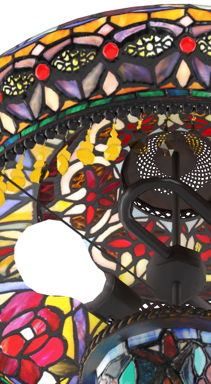

# StainedGlassLamp

## Screenshot


Above: screenshot from [Babylon.js](https://sandbox.babylonjs.com/)

## Description

This model represents a real product, a Tiffany-style stained glass table lamp being sold on [the Wayfair website](https://www.wayfair.com/lighting/pdp/fleur-de-lis-living-credle-275-table-lamp-fdlv3095.html). 

The model is made of eight parts, each with their own materials and using PNG textures, mostly 2048x2048. All UVs are arranged between 0 and 1, except for a few overlapping parts which have been offset 1 UV unit to avoid texture baking errors. The model uses 70,588 triangles and 46,828 vertices.

The model demonstrates the following extensions: 
* [KHR_materials_clearcoat](https://github.com/KhronosGroup/glTF/blob/master/extensions/2.0/Khronos/KHR_materials_clearcoat/README.md)
* [KHR_materials_transmission](https://github.com/KhronosGroup/glTF/blob/master/extensions/2.0/Khronos/KHR_materials_transmission/README.md)
* [KHR_materials_variants](https://github.com/KhronosGroup/glTF/blob/master/extensions/2.0/Khronos/KHR_materials_variants/README.md)
* [KHR_texture_basisu](https://github.com/KhronosGroup/glTF/blob/master/extensions/2.0/Khronos/KHR_texture_basisu/)

## Reference Photos

The use of real-world photographic reference is meant to help glTF developers with calibrating material features and renderer behavior, so we can more accurately represent e-commerce products. Additional photo reference is available [on the Wayfair website](https://www.wayfair.com/lighting/pdp/fleur-de-lis-living-credle-275-table-lamp-fdlv3095.html).



Above: photo of the real product (left) next to a screenshot of the glTF model (right).

Below: more reference photos of the real product.


## KHR_materials_variants

The model in `\glTF` uses the extension [KHR_materials_variants](https://github.com/KhronosGroup/glTF/blob/master/extensions/2.0/Khronos/KHR_materials_variants/README.md) to add two variants: one using emissive textures to simulate the lights being turned on, and another with the emissives disabled to simulate the lights being turned off. 



Above: animated GIF showing variants "Lamp on" and "Lamp off".

## KHR_materials_transmission

The model in `\glTF` uses the extension [KHR_materials_transmission](https://github.com/KhronosGroup/glTF/blob/master/extensions/2.0/Khronos/KHR_materials_transmission/README.md) for the stained glass, the red embedded glass gems, and the amber hanging plastic beads to show colored translucency and specular reflection.

The stained glass material uses roughness to simulate the microfacet scattering of light through the thin surface, effectively blurring the transmitted light. Behind the glass you should be able to see blurry hints of opaque surfaces like the bright lamp bulbs and the dark hardware. 

`KHR_materials_transmission` does not accurately portray the refraction that should occur on the red and amber beads. This extension offers an incremental improvement over alpha-as-coverage for glass-like transparency, by coloring the transmitted light, and allowing accurate specular reflections. These surfaces could be further improved with future extensions [KHR_materials_ior](https://github.com/KhronosGroup/glTF/pull/1718) and [KHR_materials_volume](https://github.com/KhronosGroup/glTF/pull/1726). Transmission works fine for the stained glass because the glass is thin enough and rough enough that refraction would not be that obvious.

The stained glass material uses alpha-as-coverge in alpha-test mode to cut out holes where the red beads are present. This is meant to prevent the stained glass geometry from interfering with the transmission of the red beads.


Above: animated GIF showing transmission enabled and disabled.

## KHR_materials_clearcoat

The model in `\glTF` uses the extension [KHR_texture_clearcoat](https://github.com/KhronosGroup/glTF/blob/master/extensions/2.0/Khronos/KHR_materials_clearcoat/README.md) on the multicolored stained glass to add smooth reflections on top of the glass. The glass material must be rough for `KHR_materials_transmission` to create microsurface refractions, so clearcoat restores shiny surface reflections to the smooth outer surfaces of the stained glass.

The two textures for transmissionTexture and clearcoatTexture have been packed together into a single bitmap `FDLV3095_glass_transmission-clearcoat.png` using the red and green channels, to help optimize the asset. 


Above: animated GIF showing clearcoat enabled and disabled.

## glTF-JPG-PNG

The model in `\glTF-JPG-PNG` uses no extensions. Normal maps and baseColor with alpha were kept in PNG format, while the rest were converted into JPG. The textures were downsized from 2048x2048 to various sizes, based on importance and their size on the model. The JPGs were saved from Photoshop, using Baseline Optimized format and Quality 12. 

The red embedded glass gems and the amber hanging plastic beads were set to Alpha Coverage in Blend mode, at 0.75. This approximates a transparent surface without requiring extensions. Real-world transparent surfaces often both reflect and transmit light, and completely clear glass transmits light from behind it but it is also very reflective. Alpha Coverage does not represent this behavior correctly, it simply controls the visibility of the surface; Alpha Coverage dims all surface characteristics at once. Partial alpha allows the Base Color and reflections to be partially seen, for a rough approximation of clear surfaces. This is better than no transparency at all but is not physically correct.


Above: screenshot from [Babylon.js](https://sandbox.babylonjs.com/) of model with JPG and PNG textures.

## KHR_textures_basisu

The model in `\glTF-KTX-BasisU` uses [Basis Universal](https://github.com/KhronosGroup/KTX-Software) texture compression and the extension [KHR_texture_basisu](https://github.com/KhronosGroup/glTF/blob/master/extensions/2.0/Khronos/KHR_texture_basisu/).

The aim was to achieve as close as possible the same visual quality as the original JPG/PNG textures, while compressing both file size and GPU memory size. The textures were compressed from PNG source into KTX2, using [toktx](https://github.com/KhronosGroup/KTX-Software) to apply a combination of compression settings. UASTC was used mostly for linear textures and ETCS1 mostly for sRGB textures. Normal map textures were compressed using higher quality (less postprocessing compression) to retain visual fidelity for specular. RGBA Textures were compressed using higher quality to avoid visual artifacts. 

toktx compression settings:
```
set mipmap=--genmipmap
set uastc=--uastc 4 --uastc_rdo_q 3.2 --uastc_rdo_d 65536 --zcmp 22
set uastchq=--uastc 4 --uastc_rdo_q 0.05 --uastc_rdo_d 65536 --zcmp 22
set etcs1=--bcmp --clevel 4 --qlevel 255
set folder=
toktx %mipmap% %etcs1%  ..\%folder%\StainedGlassLamp_base_basecolor.ktx2 StainedGlassLamp_base_basecolor.png
toktx %mipmap% %etcs1%  ..\%folder%\StainedGlassLamp_base_emissive.ktx2 StainedGlassLamp_base_emissive.png
toktx %mipmap% %uastc% ..\%folder%\StainedGlassLamp_glass_basecolor-alpha.ktx2 StainedGlassLamp_glass_basecolor-alpha.png
toktx %mipmap% %uastc%  ..\%folder%\StainedGlassLamp_glass_emissive.ktx2 StainedGlassLamp_glass_emissive.png
toktx %mipmap% %etcs1%  ..\%folder%\StainedGlassLamp_grill_basecolor-alpha.ktx2 StainedGlassLamp_grill_basecolor-alpha.png
toktx %mipmap% %etcs1%  ..\%folder%\StainedGlassLamp_grill_emissive.ktx2 StainedGlassLamp_grill_emissive.png
toktx %mipmap% %etcs1%  ..\%folder%\StainedGlassLamp_hardware_basecolor.ktx2 StainedGlassLamp_hardware_basecolor.png
toktx %mipmap% %etcs1%  ..\%folder%\StainedGlassLamp_hardware_emissive.ktx2 StainedGlassLamp_hardware_emissive.png

toktx %mipmap% %uastchq% --linear  ..\%folder%\StainedGlassLamp_base_normal.ktx2 StainedGlassLamp_base_normal.png
toktx %mipmap% %uastchq% --linear  ..\%folder%\StainedGlassLamp_base_occlusion-rough-metal.ktx2 StainedGlassLamp_base_occlusion-rough-metal.png
toktx %mipmap% %uastc% --linear  ..\%folder%\StainedGlassLamp_bulbs_occlusion-rough-metal.ktx2 StainedGlassLamp_bulbs_occlusion-rough-metal.png
toktx %mipmap% %uastchq% --linear  ..\%folder%\StainedGlassLamp_glass_normal.ktx2 StainedGlassLamp_glass_normal.png
toktx %mipmap% %uastc% --linear  ..\%folder%\StainedGlassLamp_glass_occlusion-rough-metal.ktx2 StainedGlassLamp_glass_occlusion-rough-metal.png
toktx %mipmap% %uastchq% --linear  ..\%folder%\StainedGlassLamp_grill_normal.ktx2 StainedGlassLamp_grill_normal.png
toktx %mipmap% %uastc% --linear  ..\%folder%\StainedGlassLamp_grill_occlusion-rough-metal.ktx2 StainedGlassLamp_grill_occlusion-rough-metal.png
toktx %mipmap% %uastchq% --linear  ..\%folder%\StainedGlassLamp_hardware_normal.ktx2 StainedGlassLamp_hardware_normal.png
toktx %mipmap% %uastc% --linear  ..\%folder%\StainedGlassLamp_hardware_occlusion-rough-metal.ktx2 StainedGlassLamp_hardware_occlusion-rough-metal.png
toktx %mipmap% %uastc% --linear  ..\%folder%\StainedGlassLamp_steel_occlusion-rough-metal.ktx2 StainedGlassLamp_steel_occlusion-rough-metal.png
```


Above: screenshots from [\<model-viewer>](https://modelviewer.dev/examples/tester.html): JPG and PNG textures (left), KTX textures (right), with size information from [glTF-Transform](https://github.com/donmccurdy/glTF-Transform).

## Path Traced Render Examples ##

This model has been tested in a few other non-rasterized renderers, which often require a few adjustments. E.g. emissive textures should be removed from non-emissive parts, allowing path tracing to create more accurate bounce lighting. 


Above: ray-traced render in Intel [OSPRay Studio](https://github.com/ospray/ospray_studio).

Below: path-traced render in Dassault Systèmes [Enterprise PBR Sample Renderer](https://github.com/DassaultSystemes-Technology/dspbr-pt).


## Authoring Details ##

The model was created with [3ds Max](https://www.autodesk.com/products/3ds-max/) and exported to glTF via the [Max2Babylon](https://github.com/BabylonJS/Exporters/tree/master/3ds%20Max) exporter. The glTF file was then edited manually in [Visual Studio Code](https://code.visualstudio.com) with the [glTF Tools](https://github.com/AnalyticalGraphicsInc/gltf-vscode) extension to add KHR extensions. [glTF-Transform](https://gltf-transform.donmccurdy.com/cli.html) was used to compress the PNG textures into KTX using ETC1S compression. 

The textures were created from photo reference, then augmented with procedural textures and hand-painted detail. The emissive textures were pre-rendered in 3ds Max using the V-Ray renderer and sphere lights, and the textures were hand-tuned to look better in Babylon.js. Because the emissives do not represent physically-accurate lighting, they can only simulate diffuse lighting not reflection/refraction, so the pure-metal and plastic-bead materials do not have emissive textures.

## License Information

(C) 2021, Wayfair LLC. CC-BY 4.0 International https://creativecommons.org/licenses/by/4.0/. 
