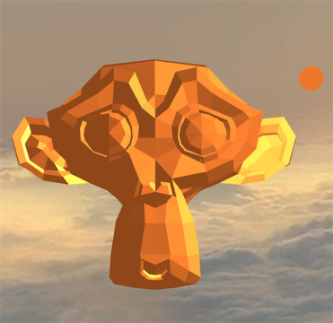

# TechniquesWebGLTest

## Screenshot

## Description

This model tests the [`KHR_techniques_webgl`](https://github.com/KhronosGroup/glTF/tree/master/extensions/2.0/Khronos/KHR_techniques_webgl) extension.The model has two objects, one is a light, the other is a Suzanne monkey.The light is turned around the monkey, and the brightness of the monkey should be affected by the movement of the light.

## License Information

Donated by [Hilo3d](https://github.com/hiloteam/Hilo3d) for glTF testing.

This model is licensed under a [Creative Commons Attribution 4.0 International License](http://creativecommons.org/licenses/by/4.0/).
