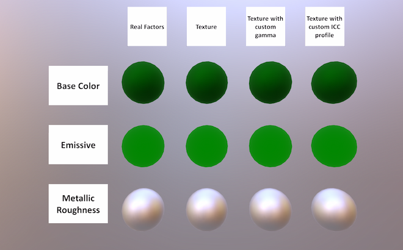

# Texture Encoding Test

## Screenshot

## Description

This asset tests that textures are sampled with correct transfer functions: base color and emissive must be decoded from sRGB while metallic-roughness values must be passed as-is.

Additionally, this asset tests that gamma values and/or ICC profiles embedded with image files are ignored as the glTF spec requires.

For each of three material slots, four sample models are provided that use different representations of the same effective material properties.

* Models from the first (leftmost) column use only JSON-stored factors to define their materials.

* Models from the second column represent the same materials using 1x1 textures with no color space metadata.

* Models from the third and fourth columns represent the same materials using 1x1 textures with custom gamma values and custom ICC profiles respectively. Stored 8-bit pixel values are the same as for the second column. An example of incorrect handling of these cases is presented on the following screenshot.

  

## License Information

Public domain ([CC0](https://creativecommons.org/publicdomain/zero/1.0/))
