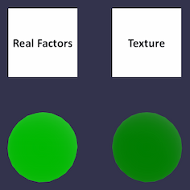

# Texture Linear Interpolation Test

## Screenshot

## Description

This asset tests that linear texture interpolation is performed on linear values, i.e. after sRGB decoding. The test passes when two spheres are rendered with nearly the same color.

* The first (leftmost) sphere uses only JSON-stored emissive factor of `0.5` green.

* The second sphere samples its color as an interpolated value from a `2x1` texture. When interpolation happens after sRGB decoding, the final emissive value should also be about `0.5` green. An example of incorrect interpolation is shown below.

  
  
> ⚠️ _**WARNING**: For technical and historical reasons, some engines — particularly those using WebGL 1.0 — apply sRGB decoding in the fragment shader. Such engines will "fail" this test, which is designed specifically to highlight a difference that is generally quite subtle. Modern APIs like WebGL 2.0 and WebGPU provide effective ways to avoid this issue._

## License Information

Public domain ([CC0](https://creativecommons.org/publicdomain/zero/1.0/))
