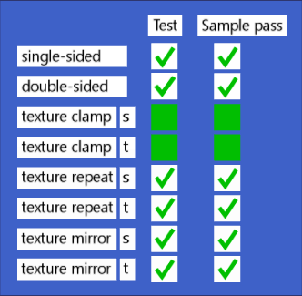

# Texture Settings Test

## Screenshot

## Description

This model tests the `doubleSided` flag for materials, and tests `REPEAT`, `CLAMP_TO_EDGE`, and `MIRRORED_REPEAT` modes for texture samplers.  When an engine loads this glTF file correctly, all of the boxes in the "Test" column should look very similar to the corresponding box in the "Sample pass" column.  In other words, they should all be green checkmarks, except the two "clamp" tests, which should be solid green boxes.

The single/double-sided tests are done by placing a polygon facing the "wrong way" in front of another test polygon.  The visibility of the front polygon is governed by the `doubleSided` flag, and the green checkmarks are placed such that they will be visible so long as the flag is respected, else some red "X" marks will be visible instead.

The texture clamp tests are done by deliberately clamping the texture coordinates against a green bar at the edge of the texture.  If repeat or mirroring is used, a red "X" will be visible instead.

The texture repeat test uses the repetition to produce the green checkmark.  If mirroring is used instead, a red "X" will become visible.  If clamping is used, the test box will turn solid red.

The texture mirror test uses mirroring to find the green checkmark.  A non-mirrored repeat will result in a red "X", and texture clamping will result in a solid red block.

All of the failure conditions are a different shape from the corresponding success condition, as well as being red in color.  Specifically, the only tests that expect a solid-green successful result do not offer a solid-red fail condition, they only offer X's.  This is so that people who are red/green colorblind can still easily compare the "Test" and "Sample" columns and easily spot any differences by shape.

## License Information

Copyright 2017 Analytical Graphics, Inc.
CC-BY 4.0 https://creativecommons.org/licenses/by/4.0/
Model and textures by Ed Mackey.
