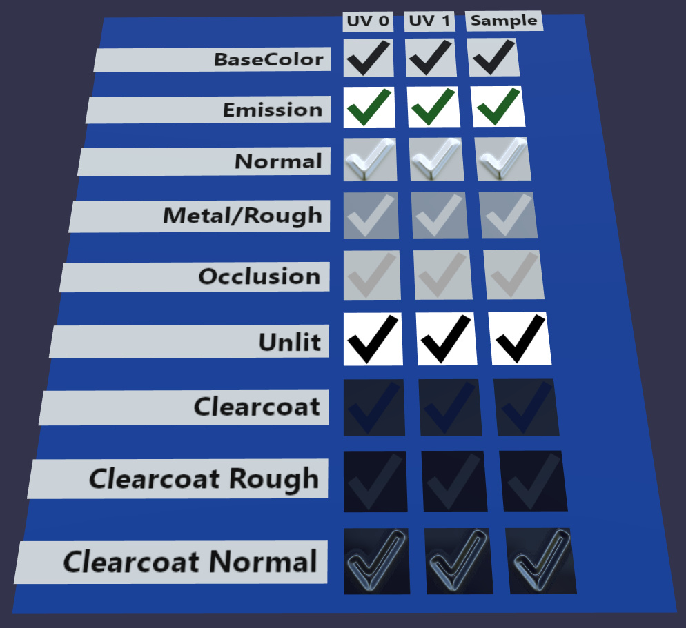
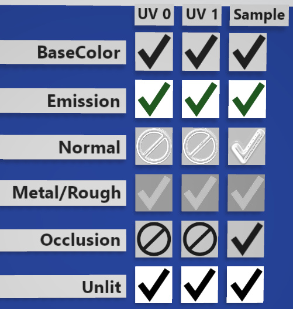
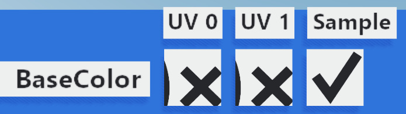
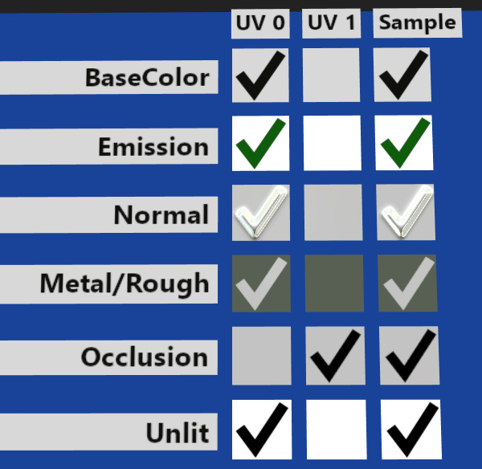
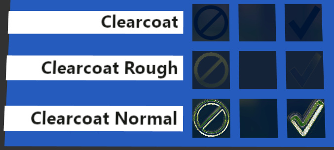

# Texture Transform Multi Test

## Screenshot

This renderer has passed every test this model has to offer.

## Description

This model tests if KHR_texture_transform is supported across a variety of different texture inputs, and whether `TEXCOORD_1` works and is also transformed.

> NOTE: When implementing KHR_texture_transform, it is recommended to test [TextureTransformTest](../TextureTransformTest) prior to testing this model.

To pass every test this model offers, an implementation should render rows of checkmarks, where each of the three tiles in a row look virtually identical.  Note that some of the rows may be very low-contrast, depending on the camera angle and lighting conditions.  A very bright, detailed reflection environment is recommended for optimal testing conditions.

## "UV 0" Column

This column renders a checkmark using `TEXCOORD_0` coordinates, transformed by KHR_texture_transform.  If the texture transform is not applied, a crossed-out circle will be visible.  If the `TEXCOORD_0` coordinates have not been used, the box may be blank.

## "UV 1" Column

This column works the same as the previous column, except it uses `TEXCOORD_1` coordinates, transformed by KHR_texture_transform.

## "Sample" Column

This column offers only a single set of texture coordinates, and does not require any transformation.  It is intended to be a control column, showing what the checkmark looks like rendered in the row's input channel under test.  Some inputs such as Clearcoat may be un-supported, in which case all 3 boxes will be completely dark.  That can still be considered a "pass" for this model, as the goal is to test texture coordinates and transforms here, not Clearcoat support.

The "Occlusion" row may appear blank when rendered in path tracers or ray tracers that calculate their own ambient occlusion.  That can also be considered a "pass."

## Problem: Certain Inputs Not Transformed

In the above test, the renderer has produced a "UV 1" column that is identical to "UV 0", indicating it has done a good job processing `TEXCOORD_0` and `TEXCOORD_1` the same way.  However, it displays crossed-out circles for the "Normal" and "Occlusion" inputs, indicating that KHR_texture_transform has not been applied to those two inputs.

## Problem: Incorrect Application of Transforms

If an "X" or other improper shape appears, it likely indicates that the KHR_texture_transform math has not been correctly applied.  Try the [TextureTransformTest](../TextureTransformTest) model, to test each piece of the transformation individually.

If the crossed-out circle appears, it means that no transformation has been applied at all.

## Problem or Known Limitation: TEXCOORD_1 Not Fully Supported

The renderer that produced this image has a known limitation, where `TEXCOORD_1` is only supported for the Occlusion input.  This manifests itself as blank boxes down most of the "UV 1" column, except for Occlusion.

But an additional limitation is revealed here:  In the "Occlusion" "UV 0" test is also showing a blank box.  The mere presence of multiple UV sets in that box has caused this renderer to improperly use `TEXCOORD_1`, disregarding the model's UV index `0` selection.  But in the "Sample" column, only one set of UVs are available, so the checkmark is correctly rendered there.

## Problem: Clearcoat Not Transformed

The Clearcoat tests can be dark and low-contrast, an unfortunate consequence of the subtle nature of the clear coating.  Use a bright reflection environment, or possibly post-process the resulting image in a paint program to bring out more contrast, as shown here.  Two of the rows have curved test boxes, to help reflect more of the surrounding environment.

The "UV 1" boxes shown here are blank due to a known limitation in this rendering engine, described above.  But the "UV 0" boxes are showing the crossed-out circle.  This indicates that KHR_texture_transform has not been applied to any of the Clearcoat inputs.

## License Information

Copyright 2020 Analytical Graphics, Inc.
CC-BY 4.0 https://creativecommons.org/licenses/by/4.0/
Model and textures by Ed Mackey.
