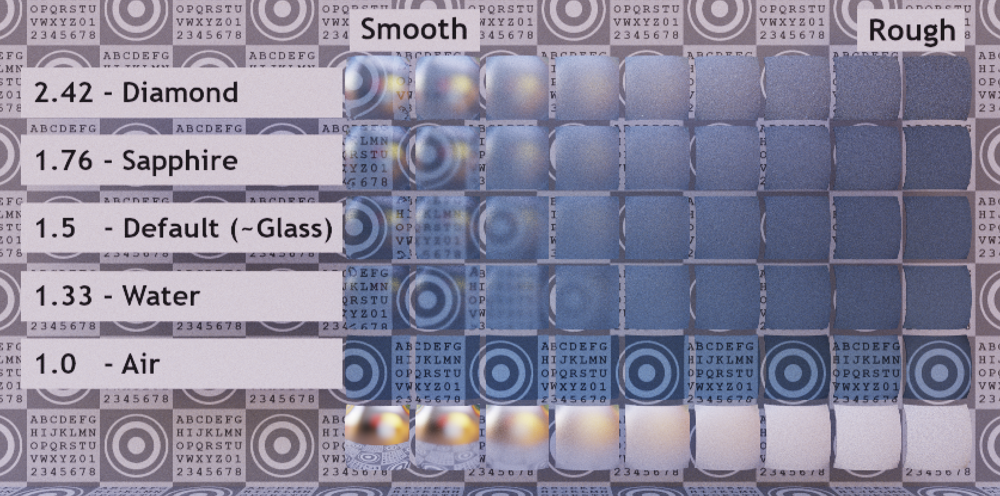
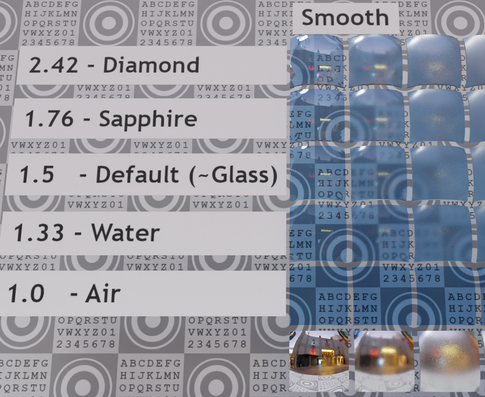

# Transmission Roughness Test

## Screenshot

Path-traced render by the [Enterprise PBR Sample Renderer](https://github.com/DassaultSystemes-Technology/dspbr-pt), using IBL "Footprint Court" by [HDR Labs](http://www.hdrlabs.com/sibl/archive.html).

## Description

This model tests the interaction between IOR (Index of Refraction) and the perceived roughness of transmission.

In glTF's physically-based material model, a surface has "[microfacets](https://github.com/KhronosGroup/glTF/blob/master/specification/2.0/README.md#microfacet-surfaces)" which are a statistical distribution of sub-pixel, sub-texel perturbations in the surface normal.  The strength of these normal perturbations are controlled by the surface's [roughness](https://github.com/KhronosGroup/glTF/blob/master/specification/2.0/README.md#metallic-roughness-material) parameter.  When these surface normal perturbations become strong, they may cause a specular reflection to become blurry.

A similar effect can take place with transmission.  When light passes through microfacets with an IOR greater than 1.0, different rays at a sub-pixel level may be refracted in different directions, blurring the transmitted image.  But the same is not true when the IOR is equal to exactly 1.0.  With IOR = 1.0, light vectors do not change regardless of how strong the microfacet angles become.  When this happens, transmission will be sharp and non-blurred, regardless of the material's roughness, because the microfacets cannot alter the direction of transmitted light.

Progressively higher values for IOR will result in the apparent blurriness of transmission becoming stronger, even while the blurriness of reflected light remains constant.  This is because when IOR changes, the microfacets aren't changing the steepness of their angles, only changing the amount of distortion applied to transmitted light.

This effect applies to both thick volumes and thin-walled materials.  In the case of thin-walled materials, the material is said to be "infinitely thin" meaning the front and back surface normals will be equal.  The effects of IOR on each side cancel each other out, resulting in no overall refraction of light passing through the thin material.  However, the microfacets on the front and back sides of the material are believed to be uncorrelated.  On a rough, thin-walled material, any given microfacet on the front surface need not use the same perturbation as the corresponding microfacet on the back surface.  So, with the front and back microfacet normals not being equal, any IOR > 1.0 can perturb the transmitted light at the sub-pixel level, producing blurriness.

The higher the IOR, the more blurriness these microfacets will produce in the transmission.

## Extensions Used

This model uses three extensions: `KHR_materials_transmission`, `KHR_materials_ior`, and `KHR_materials_volume`.  At the time of this writing, the latter two extensions are still in "Draft" status, and not all glTF renderers support these extensions.  This test model is intended to help verify the rendering of models with these extensions.  Note that real-time rasterizers are generally not expected to be able to exactly reproduce the path-traced screenshots shown here.  Different real-time rendering approximations will produce different results.

## Model Details

This model shows a grid of transmissive tiles, with increasing roughness along the horizontal axis, and increasing IOR along the vertical axis.  The row across the bottom shows a simple non-transmissive mirror surface with the same roughness as the tiles above, for comparison.

The leftmost column of tiles represents a perfectly smooth surface, where there effectively aren't any microfacets to perturb the reflection or transmission.  A correct rendering of this column will not produce any blurriness, either as reflections or in the transmitted image.  However, the strength of the reflections will become more pronounced at higher IOR values in the upper rows.

The lowest transmissive row, labeled "1.0 - Air" represents a blue-tinted gas with IOR = 1.0.  Light passing from outside air through blue-tinted air will not reflect or refract in any way, regardless of the presence of any microfacet deviations in the boundary.  As a result there should not be any reflection visible in this row's render, and the transmitted image should be in sharp focus across the entire row.

In the screenshots presented here, the second transmissive column most clearly shows the effect this model is built to demonstrate.  The bottom tile is sharp and non-reflective, and each higher tile shows a blurrier transmission paired with stronger (but not blurrier) reflections.  This shows the effects that IOR has even in the near-absence of macroscopic refraction (due to the relatively thin layer of material in the tile, producing nearly-identical front and back surface normals).

This render is from Blender's Cycles path-tracing engine, using the same IBL as above.

## License Information

Copyright 2021 Analytical Graphics, Inc.  
CC-BY 4.0 https://creativecommons.org/licenses/by/4.0/  
Model and textures by Ed Mackey.
