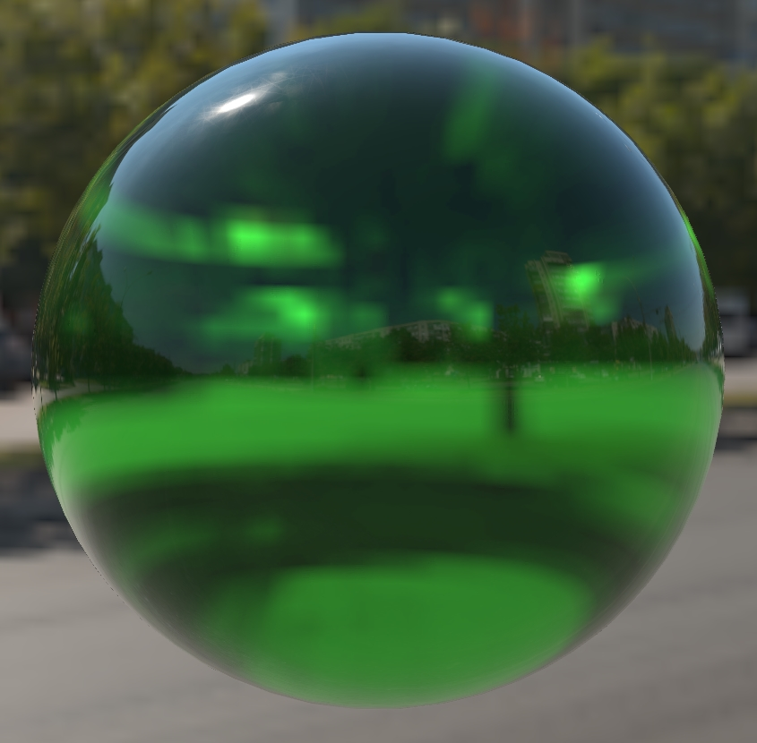

# TransmissionSphere

## Screenshot

Screenshot from the [glTF Sample Viewer](https://github.khronos.org/glTF-Sample-Viewer-Release/) with the Wide Street environment light.

## Description

This model is a sphere using the glTF extensions [`KHR_materials_transmission`](https://github.com/KhronosGroup/glTF/tree/master/extensions/2.0/Khronos/KHR_materials_transmission) and [`KHR_materials_volume`](https://github.com/KhronosGroup/glTF/tree/master/extensions/2.0/Khronos/KHR_materials_volume) to create a colored glass material. 

The color of the glass comes from the `attenuationColor` and `attenuationDistance` properties in `KHR_materials_volume`.

The model includes a single bitmap for the roughness texture containing scratches and fingerprints. For better precision the texture includes a full range in 8bit grayscale and uses `roughnessFactor` to reduce the strength of the roughness effect. The fingerprints and scratches usually only appear when the model is lit by a strong key light such as the sun.  

## License Information

CC0, No Rights Reserved, https://creativecommons.org/share-your-work/public-domain/cc0/. Model and texture created by Eric Chadwick.
