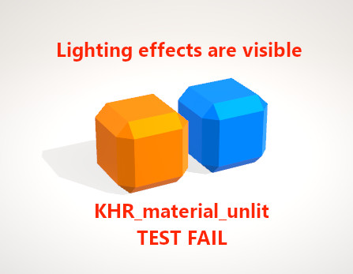

# Unlit Test

## Screenshot

## Description

This model tests the [`KHR_materials_unlit`](https://github.com/KhronosGroup/glTF/tree/master/extensions/2.0/Khronos/KHR_materials_unlit) extension.  There are two objects, one orange-ish (`#FF7F00` in sRGB space) and one blue-ish (`#007FFF` in sRGB space).  The visible surface of these two objects should appear as a uniform color, so much so that the 3D effect is intentionally lost.

## Problem: Lighting applied to un-lit model

The above screenshot shows a case where normal lighting calculations have been applied to an un-lit material.  While the shadows on the ground are permissible, the various panels and edges visible on the orange and blue objects are not.

## License Information

Copyright 2018 Analytical Graphics, Inc.
CC-BY 4.0 https://creativecommons.org/licenses/by/4.0/
Model and textures by Ed Mackey.
