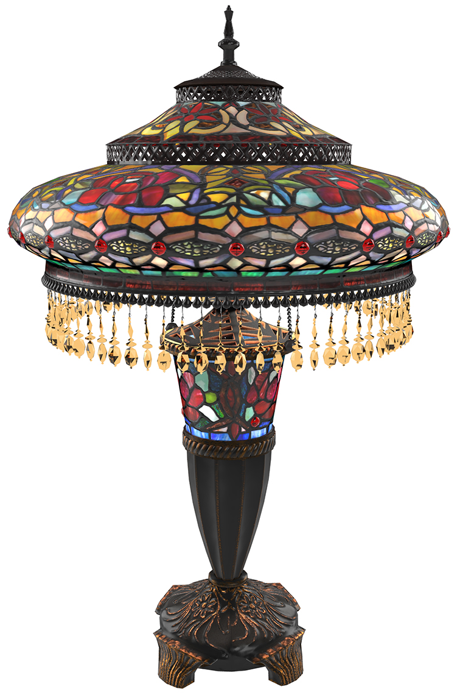

# StainedGlassLamp

## Screenshot

Above: screenshot from [Babylon.js](https://sandbox.babylonjs.com/).

## Description

This model represents a real product, a Tiffany-style stained glass table lamp being sold [on the Wayfair website](https://www.wayfair.com/lighting/pdp/fleur-de-lis-living-credle-275-table-lamp-fdlv3095.html). The use of real-world photographic reference is meant to help glTF developers with calibrating material features and renderer behavior, so we can more accurately represent e-commerce products. 

The model was created with [Autodesk 3ds Max](https://www.autodesk.com/products/3ds-max/) and exported to glTF via the [Max2Babylon](https://github.com/BabylonJS/Exporters/tree/master/3ds%20Max) exporter. The glTF file was then edited manually in [Visual Studio Code](https://code.visualstudio.com) with the [glTF Tools](https://github.com/AnalyticalGraphicsInc/gltf-vscode) extension to add KHR extensions. 

The model is made of eight parts, each with their own materials and using PNG textures, mostly 2048x2048. All UVs are arranged between 0 and 1, except for a few overlapping parts which have been offset 1 UV unit to avoid texture baking errors. The model uses 55,428 triangles and 51,174 vertices.

The textures were created from photo reference, augmented with procedural textures and hand-painted detail. The emissive textures were pre-rendered in 3ds Max using the V-Ray renderer and sphere lights, and the textures were hand-tuned to work with baseColor and transmission.

The model demonstrates several extensions: 
* [KHR_materials_clearcoat](https://github.com/KhronosGroup/glTF/blob/master/extensions/2.0/Khronos/KHR_materials_clearcoat/README.md)
* [KHR_materials_ior](https://github.com/KhronosGroup/glTF/pull/1718)
* [KHR_materials_translucency](https://github.com/KhronosGroup/glTF/pull/1825)
* [KHR_materials_transmission](https://github.com/KhronosGroup/glTF/blob/master/extensions/2.0/Khronos/KHR_materials_transmission/README.md)
* [KHR_materials_variants](https://github.com/KhronosGroup/glTF/blob/master/extensions/2.0/Khronos/KHR_materials_variants/README.md)
* [KHR_materials_volume](https://github.com/KhronosGroup/glTF/pull/1726)
* [KHR_texture_basisu](https://github.com/KhronosGroup/glTF/blob/master/extensions/2.0/Khronos/KHR_texture_basisu/)

## License Information

(C) 2021, Wayfair LLC. CC-BY 4.0 International https://creativecommons.org/licenses/by/4.0/. 